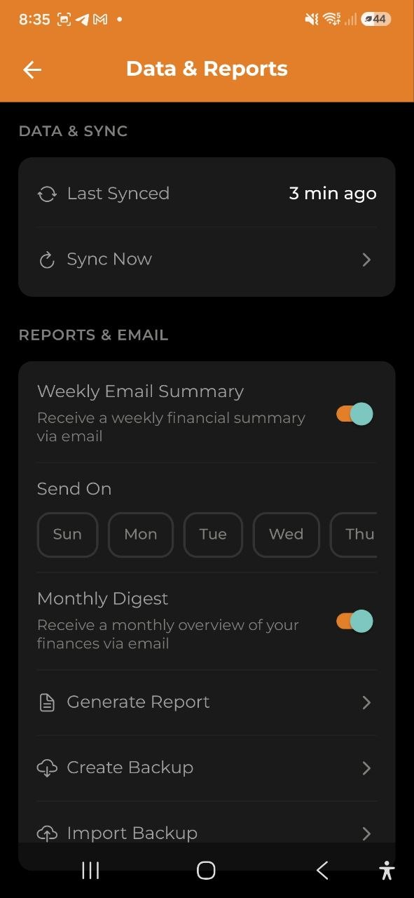

# Экспарт і справаздачы

> Генеруйце PDF, Excel і CSV справаздачы сваіх фінансаў. Праглядайце штомесячныя дайджэсты выдаткаў, ствараць зашыфраваныя рэзервовыя копіі і атрымлівайце аўтаматызаваныя email-зводкі.

## Агляд

Экран **Экспарт і справаздачы** дазваляе генераваць фінансавыя справаздачы, праглядаць штомесячныя дайджэсты, спампоўваць/дзяліцца справаздачамі і кіраваць рэзервовымі копіямі даных. Атрымаць доступ можна з укладкі Аналітыка праз кнопку **Экспарт справаздачы** або праз **Налады** > **Справаздачы і email** > **Генераваць справаздачу**.

## Фарматы справаздач

Даступныя тры фарматы экспарту:

| Фармат | Апісанне | Даступнасць |
|---|---|---|
| **CSV** | Значэнні, падзеленыя коскамі, сумяшчальныя з Excel і Google Sheets | Усе планы |
| **PDF** | Фарматаванае справаздача са зводкай, разбіўкай па катэгорыях і спісам транзакцый | Усе планы |
| **Excel** | Кніга з некалькімі аркушамі: Зводка, Выдаткі і Даходы | Усе планы |

Стварэнне справаздач і рэзервовых копій бясплатнае на ўсіх планах. Платнай з'яўляецца толькі аўтаматычная адпраўка на e-mail, апісаная ніжэй.

Вынікі падаюцца ў **вашай валюце адлюстравання** — той, што на кнопцы на галоўным экране, а не ў валюце якойсьці адной транзакцыі. Сумы, запісаныя ў іншай валюце, пералічваюцца па цяперашніх курсах перш чым нешта складаецца, і справаздача пра гэта паведамляе. Кожная транзакцыя ў спісе захоўвае сваю валюту, таму заўсёды відаць, што было запісана насамрэч. Калі курс недаступны, такая сума не ўваходзіць у вынікі замест таго, каб быць палічанай у чужой валюце, — справаздача пазначае і гэта.

## Генерацыя справаздачы

1. Выберыце **фармат** (CSV, PDF або Excel)
2. Выберыце **перыяд часу**:
   - **Мінулы тыдзень** — апошнія 7 дзён
   - **Гэты месяц** — з 1-га чысла па сёння
   - **Мінулы квартал** — апошні *поўны* каляндарны квартал (у жніўні гэта красавік-чэрвень). Перыяд закрыты, таму яго цыфры больш не змяняюцца
   - **Гэты год** — з 1 студзеня па сёння
   - **Канкрэтны месяц** — любы асобны месяц цалкам з апошніх 24
   - **Свой перыяд** — свая дата пачатку і заканчэння
3. Націсніце **Генераваць**
4. Справаздача ствараецца і **захоўваецца**. На Android адкрываецца выбар папкі, і файл запісваецца туды, куда вы ўкажаце — дадатак потым пакажа шлях. На iOS адкрываецца сістэмнае меню, адкуль даступна «Захаваць у Файлы». У вэб-версіі файл проста спампоўваецца. Калі скасаваць выбар папкі, нічога не захаваецца — справаздача ўсё роўна застанецца ў спісе ніжэй.
5. Справаздача таксама з'яўляецца ў раздзеле **Апошнія справаздачы** для далейшага доступу

Пад кнопкамі відаць дакладныя даты, якія трапяць у справаздачу — тыя ж даты друкуюцца ў загалоўку файла. Калі свой перыяд пазначаны не цалкам або яго пачатак пазней за канец, кнопка **Стварыць** застаецца неактыўнай.

Калі адкрыць гэты экран кнопкай **Экспартаваць справаздачу** на закладцы Аналітыка, сюда пераносіцца той перыяд, які вы там глядзелі — адлісталі да чэрвеня, значыць справаздача гатуецца за чэрвень, а не за цяперашні месяц. Незакончаны перыяд заканчваецца сённяшнім днём, завершаны бярэцца цалкам.

Справаздачы захоўваюцца на працягу 7 дзён, а потым аўтаматычна выдаляюцца.

## Штомесячны дайджэст

Здымак вашай бягучай фінансавай актыўнасці за месяц:

- **Усяго даходу** і **Усяго выдаткаў**
- **Каэфіцыент эканоміі** — адсотак даходу, які вы зэканомілі
- **Топ катэгорыі** — вашы найбольшыя катэгорыі выдаткаў з сумамі
- Даныя кэшуюцца на 7 дзён і абнаўляюцца аўтаматычна
- Заўсёды **цяперашні** месяц — не залежыць ад выбранага вышэй перыяду

## Апошнія справаздачы

Спіс вашых нядаўна згенераваных справаздач з наступнымі дадзенымі:

- Значок фармату (CSV/PDF/Excel)
- Імя файла і дата стварэння
- Памер файла
- Кнопка **Спампаваць** — захоўвае файл на прыладу (Android: выбар папкі праз SAF; iOS: захаваць у «Файлы»)
- Кнопка **Падзяліцца** — адкрывае сістэмнае меню для адпраўкі справаздачы па пошце, у месенджарах або іншых праграмах

## Рэзервовая копія даных

Даступна на **усіх планах**:

- **Стварыць рэзервовую копію** — стварае поўную JSON рэзервовую копію даных вашага рахунку (выдаткі, даходы, бюджэты, катэгорыі, тэгі, праекты, кашалькі і г.д.)
  - **Куды захоўваецца файл:** На Android адкрываецца выбар папкі, і копія запісваецца ў абраную вамі папку — пасля гэтага праграма паказвае дакладны шлях. Калі прапусціць выбар папкі (або на iOS), замест гэтага адкрываецца сістэмнае меню «Падзяліцца», каб вы маглі захаваць файл у «Файлы», «Спампоўкі» або воблачны дыск. Паведамленне пра поспех з'яўляецца толькі пасля таго, як файл сапраўды захаваны або адпраўлены.
- **Імпартаваць рэзервовую копію** — загрузка і аднаўленне даных з раней створанай копіі
- Калі шыфраванне ўключана, зашыфраваныя палі ўключаюцца ў рэзервовую копію як ёсць

Атрымаць доступ да рэзервовай копіі можна праз **Налады** > **Справаздачы і email**.

## Email-справаздачы

Аўтаматызаваныя email-зводкі, якія даставяюцца на вашу паштовую скрыню:

| Функцыя | Апісанне | Патрабуецца план |
|---|---|---|
| **Штотыднёвая email-зводка** | Тыднёвы агляд выдаткаў з топ катэгорыямі | Business |
| **Штомесячны email-дайджэст** | Месячная зводка з параўнаннем месяц да месяца | Pro і Business |

Наладзіць іх можна ў **Налады** > **Справаздачы і email**:

- Уключыць/выключыць штотыднёвыя/штомесячныя email
- Выбраць дзень тыдня для штотыднёвых справаздач (панядзелак па змаўчанні)

## Шыфраванне і справаздачы

- **Узровень 0** (без шыфравання) — усе даныя адлюстроўваюцца карэктна ў справаздачах
- **Узровень 1** (шыфраванне тэксту) — сумы адлюстроўваюцца карэктна; назвы катэгорый і апісанні могуць быць пустымі ў серверна згенераваных справаздачах. Штомесячны дайджэст вызначае назвы катэгорый з вашых лакальных даных прылады
- **Узровень 2** (поўнае шыфраванне) — справаздачы недаступныя (сумы зашыфраваны на баку сервера)

## Частыя пытанні

- **П: Чаму я бачу пустыя назвы катэгорый у маім PDF справаздачы?**
  **А:** Калі ў вас уключана E2EE (Узровень 1), назвы катэгорый зашыфраваны на серверы. Серверна згенераванае справаздача не можа іх расшыфраваць. Сумы застаюцца дакладнымі.

- **П: Як доўга захоўваюцца справаздачы?**
  **А:** Справаздачы аўтаматычна выдаляюцца праз 7 дзён. Спампоўвайце іх імгненна пасля генерацыі.

- **П: Ці магу я экспартаваць даныя з агульнага рахунку?**
  **А:** Так, любы ўдзельнік рахунку можа генераваць справаздачы і рэзервовыя копіі для агульнага рахунку.

- **П: Што ўключана ў рэзервовую копію?**
  **А:** Усё: выдаткі, даходы, бюджэты, катэгорыі, тэгі, праекты, кашалькі, пераводы і валютныя абмены для бягучага рахунку.

---

*Гл. таксама: [Аналітыка](./06-analytics.md) | [Налады](./11-settings.md) | [Тарыфныя планы](./12-subscription.md) | [Скразное шыфраванне](./15-encryption.md)*
