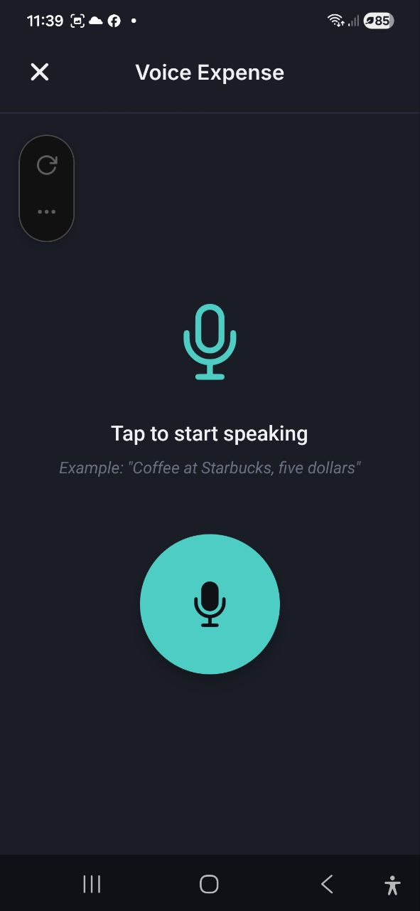
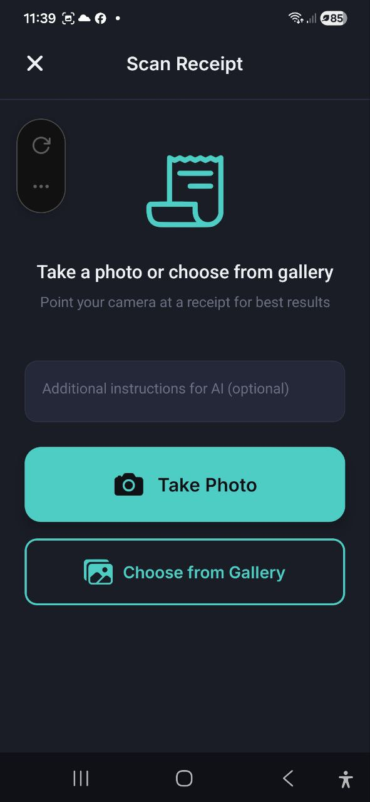

# Spracheingabe & Beleg scannen

> Lass die KI die Arbeit machen. Sprich deine Ausgabe naturlich aus oder fotografiere einen Beleg — die App extrahiert Betrag, Beschreibung, Handler und Kategorie automatisch.

## Sprachausgabe

### So funktioniert es

1. Tippe auf **Spracheingabe** bei den Schnellaktionen der Ubersicht, oder tippe auf **+** auf dem Transaktionen-Bildschirm und wahle **Spracheingabe**
2. Du siehst ein grosses Mikrofonsymbol mit dem Text **"Tippen, um zu sprechen"**
3. Tippe auf die Mikrofon-Schaltflache, um die Aufnahme zu starten
4. Sprich naturlich, zum Beispiel: *"Kaffee bei Starbucks, funf Euro"*
5. Tippe erneut, um die Aufnahme zu stoppen
6. Die App verarbeitet deine Sprache und extrahiert die Ausgabendetails

### Bestatigungsbildschirm

Nach der Verarbeitung siehst du eine Bestatigung mit den erkannten Daten:

- **Betrag** — aus deiner Sprache extrahiert (bearbeitbar)
- **Beschreibung** — wofur die Ausgabe war (bearbeitbar)
- **Handler** — wo du ausgegeben hast (bearbeitbar)
- **Kategorie** — automatisch zugewiesen (bearbeitbar)
- **Zuverlassigkeit**-Indikator — **Hohe Zuverlassigkeit** oder **Mittlere Zuverlassigkeit**

Uberprufe die Details, nimm Korrekturen vor, dann:
- Tippe auf **Ausgabe speichern**, um zu bestatigen und zu speichern
- Tippe auf **Erneut versuchen**, um erneut aufzunehmen

Nach dem Speichern kannst du auf **Weitere hinzufugen** tippen, um eine neue Sprachausgabe aufzunehmen.

### Tipps fur beste Ergebnisse

- Sprich deutlich und nenne sowohl den Artikel/die Beschreibung als auch den Betrag
- Nenne den Handlernamen, wenn relevant (z.B. "Mittagessen bei McDonald's, zwolf Euro")
- Gib die Wahrung an, wenn sie sich von deiner Standardwahrung unterscheidet
- Halte es einfach — eine Ausgabe pro Aufnahme

## Beleg scannen

### So funktioniert es

1. Tippe auf **Beleg scannen** bei den Schnellaktionen der Ubersicht, oder tippe auf **+** auf dem Transaktionen-Bildschirm und wahle **Beleg scannen**
2. Du siehst drei Optionen:
   - **Foto aufnehmen** — offnet deine Kamera zum Fotografieren des Belegs
   - **Aus Galerie wahlen** — wahle ein vorhandenes Foto
   - **PDF hochladen** — wahle eine PDF-Datei (digitale Rechnungen, gescannte Belege, bis 10 MB)
3. Optional kannst du **Zusatzliche Anweisungen fur KI** eingeben (z.B. "Gleichmassig auf zwei Personen aufteilen", "Trinkgeld ignorieren")
4. Die App analysiert den Beleg und extrahiert die Daten

### Bestatigungsbildschirm

Nach der KI-Analyse siehst du:

- **Gesamtbetrag** — vom Beleg extrahiert (bearbeitbar)
- **Beschreibung** — generierte Zusammenfassung (bearbeitbar)
- **Handler** — Geschaft-/Restaurantname (bearbeitbar)
- **Kategorie** — automatisch zugewiesen (bearbeitbar)
- **Datum** — vom Beleg (bearbeitbar)
- **Artikel** — einzelne Positionen mit Mengen und Preisen (falls erkannt)
- **Rabatt** — Rabattbetrag (falls auf dem Beleg vorhanden)
- **Zuverlassigkeit**-Indikator — **Hohe Zuverlassigkeit** oder **Mittlere Zuverlassigkeit**
- **Kassenbon-Bild speichern**-Schalter — das Foto an die Ausgabe anhangen

Uberprufe und korrigiere Details, dann:
- Tippe auf **Ausgabe speichern**, um zu bestatigen
- Tippe auf **Erneut scannen**, um ein anderes Foto zu versuchen

### Tipps fur beste Ergebnisse

- Fotografiere bei guter Beleuchtung — vermeide Schatten und Blendung
- Stelle sicher, dass der gesamte Beleg sichtbar und flach ist
- Halte die Kamera ruhig, um Unscharfe zu vermeiden
- Verwende **Zusatzliche Anweisungen fur KI** fur besondere Handhabung (z.B. "Das ist in EUR", "Ersten Artikel ignorieren")

### Aufteilung nach Kategorien

Kassenbons vom Supermarkt enthalten oft mehrere Arten von Artikeln in einem Einkauf — Lebensmittel, Haushaltsartikel, Alkohol. Wenn die App mehr als eine Art von Artikel auf einem Beleg erkennt, teilt sie die Ausgabe automatisch auf die passenden Kategorien auf, anstatt alles einer einzigen zuzuordnen.

- Auf dem Bestätigungsbildschirm erscheint über der Artikelliste eine Reihe von Kategorie-Chips mit der Bezeichnung **Nach Kategorie aufteilen** (zum Beispiel „Lebensmittel 180 · Haushalt 35 · Alkohol 25"), die zeigt, wie der Gesamtbetrag aufgeteilt wird.
- Tippe auf **Kategorien ändern**, um eine Liste aller Artikel zu öffnen und anzupassen, zu welcher Kategorie sie gehören. Deine Änderungen gelten sofort — und werden gemerkt, sodass dasselbe Produkt beim nächsten Scan korrekt kategorisiert wird.
- Wenn die Artikel nicht ausreichend genau zum Gesamtbetrag des Belegs passen, greift die App auf eine einzige Kategorie zurück, statt zu raten.
- Pfand für Flaschen und Dosen wird erkannt und als eigene Kategorie angezeigt, damit du siehst, wie viel deiner Ausgaben aus Verpackung besteht, die du zurückbekommst.
- Das ändert nur, wie deine Ausgaben in der Analyse und in den Diagrammen erscheinen — es ändert nie deine Budgets, die weiterhin gegen die eine Gesamtkategorie des Belegs geführt werden.
- Manchmal passt keine deiner bestehenden Kategorien zu einer Gruppe von Artikeln. In diesem Fall schlägt die App eine brandneue Kategorie vor, angezeigt als Chip mit einem **+**-Zeichen (zum Beispiel „+ Haushaltschemie 10"). Sie wird noch nicht angelegt — tippe auf **Kategorien ändern**, um ihre Artikel stattdessen einer bestehenden Kategorie zuzuweisen oder sie wie vorgeschlagen zu belassen. Die neue Kategorie wird erst angelegt, wenn du den Beleg speicherst.

Funktioniert genauso, egal ob du über die App oder über die Telegram-, WhatsApp- oder Slack-Bots scannst.

## Spracheingabe Einnahmen

Erfasse erhaltene Zahlungen per Sprache — gleicher Ablauf wie bei der Sprachausgabe, optimiert für Einnahmen.

### So funktioniert es

1. Tippe auf **Spracheingabe Einnahmen** bei den Schnellaktionen der Übersicht, oder tippe auf das Mikrofonsymbol in der Fußzeile des **Einnahme hinzufügen**-Formulars
2. Tippe auf die (grüne) Mikrofon-Schaltfläche, um die Aufnahme zu starten
3. Sprich natürlich, zum Beispiel: *"500 vom Kunden erhalten, Beratungshonorar"*
4. Tippe erneut, um die Aufnahme zu stoppen
5. Die App extrahiert den Betrag, die Beschreibung und die am besten passende **Einnahmenkategorie**

### Bestätigungsbildschirm

- **Betrag** — aus deiner Sprache extrahiert (bearbeitbar)
- **Beschreibung** — wofür die Zahlung war (bearbeitbar)
- **Kategorie** — Einnahmenkategorie automatisch zugewiesen (bearbeitbar)
- **Währung** — erkannt oder auf deine Standardwährung zurückgesetzt

Tippe auf **Einnahme speichern**, um zu bestätigen, oder auf **Erneut versuchen**, um neu aufzunehmen.

### Tipps für beste Ergebnisse

- Nenne den Betrag und eine kurze Beschreibung
- Gib die Währung an, wenn sie sich von deiner Standardwährung unterscheidet

---

## Rechnung scannen

Fotografiere oder lade eine Rechnung oder ein Zahlungsdokument hoch, um Einnahmen automatisch zu erfassen.

### So funktioniert es

1. Tippe auf **Rechnung scannen** bei den Schnellaktionen der Übersicht, oder tippe auf das Dokumentsymbol in der Fußzeile des **Einnahme hinzufügen**-Formulars
2. Wähle **Foto aufnehmen**, **Aus Galerie wählen** oder **PDF hochladen**
3. Optional kannst du **Zusätzliche Anweisungen für KI** eingeben
4. Die App extrahiert den Gesamtbetrag, das Datum und die Kategorie

### Bestätigungsbildschirm

- **Gesamtbetrag** — aus dem Dokument extrahiert
- **Beschreibung** — generierte Zusammenfassung
- **Kategorie** — Einnahmenkategorie automatisch zugewiesen
- **Datum** — aus dem Dokument

Überprüfe die Details, tippe auf ✓ zum Speichern oder auf das Stiftsymbol, um das vollständige Einnahme-Formular mit vorausgefüllten Daten zu öffnen.

> **Hinweis:** Die Rechnungs-OCR extrahiert nur Gesamtbetrag und Datum. Einzelpositionen aus Rechnungen werden absichtlich ignoriert, um Doppelzählungen bei mehrzeiligen Abrechnungsdokumenten zu vermeiden.

---

## FAQ

- **F: Welche Sprachen unterstutzt die Spracheingabe?**
  **A:** Die Spracheingabe funktioniert am besten in der Sprache, auf die deine App eingestellt ist. Sie unterstutzt alle 8 App-Sprachen.

- **F: Kann ich Belege in jeder Sprache scannen?**
  **A:** Ja, die KI kann Belege in den meisten Sprachen verarbeiten und extrahiert Betrage und Artikel unabhangig von der Belegsprache.

- **F: Welche PDF-Dateien werden unterstutzt?**
  **A:** Sowohl digitale PDFs (z.B. Amazon- oder PayPal-Rechnungen) als auch gescannte PDF-Belege werden unterstutzt. Maximale Dateigrose: 10 MB. Digitale PDFs mit selektierbarem Text werden schneller und genauer verarbeitet. Bei gescannten PDFs sollte der Scan klar und kontraststark sein.

- **F: Warum war der Betrag nach dem Scannen falsch?**
  **A:** Die KI-Extraktion ist nicht immer perfekt. Uberprufe immer den Bestatigungsbildschirm und korrigiere Fehler vor dem Speichern. Unscharfe oder beschadigte Belege konnen weniger genaue Ergebnisse liefern.

- **F: Verbrauchen Spracheingabe/Belegscan meine KI-Anfragen?**
  **A:** Ja, jede Spracheingabe oder jeder Belegscan verbraucht eine KI-Anfrage aus deinem monatlichen Kontingent.

- **F: Warum wurde ein Beleg in meinen Diagrammen auf mehrere Kategorien aufgeteilt?**
  **A:** Wenn ein Beleg deutlich unterschiedliche Arten von Artikeln enthält (zum Beispiel Lebensmittel und Alkohol), teilt die App ihn automatisch auf die passenden Kategorien in deinen Ausgabendiagrammen auf. Das ändert nie deine Budgets. Tippe auf **Kategorien ändern** auf dem Bestätigungsbildschirm des Belegs, um es anzupassen — Korrekturen werden für das nächste Mal gemerkt.

---

*Siehe auch: [Ausgaben & Einkommen](./03-expenses-and-income.md) | [KI-Chat](./07-ai-chat.md)*
