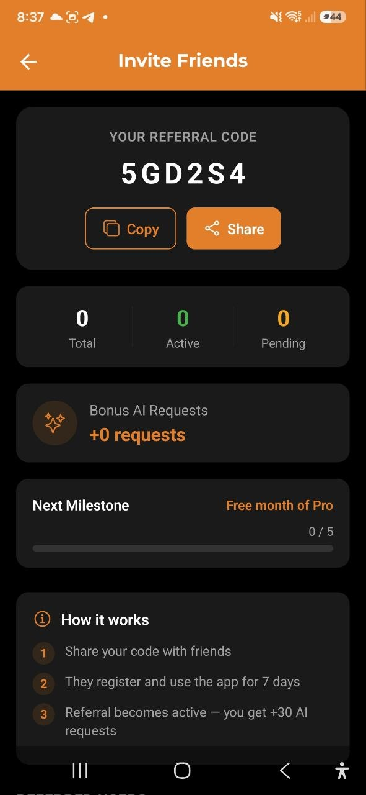

# Freunde einladen — Empfehlungsprogramm

> Lade Freunde ein, verdiene Bonus-AI-Anfragen und schalte Meilensteine frei. Teile deinen einzigartigen Empfehlungscode und werde belohnt, wenn Freunde die App aktiv nutzen.

## Überblick

Das Empfehlungsprogramm ermöglicht es dir, Freunde zu AI Budget Assistant einzuladen. Wenn sie sich mit deinem Code registrieren und die App 7 Tage aktiv nutzen, erhältst du **+30 Bonus-AI-Anfragen**. Eingeladene Freunde erhalten eine **verlängerte 14-tägige Testphase** statt der standardmäßigen 7 Tage.

## Dein Empfehlungscode

Jeder Benutzer hat einen einzigartigen 6-stelligen Empfehlungscode. Du findest ihn auf dem Bildschirm **Freunde einladen**:

1. Gehe zu **Einstellungen** → **Freunde einladen**
2. Dein Code wird oben auf dem Bildschirm angezeigt
3. Tippe auf **Kopieren**, um den Code in die Zwischenablage zu kopieren
4. Tippe auf **Teilen**, um ihn über einen Messenger zu senden

## So funktioniert es

1. **Teile deinen Code** — sende ihn per Messenger oder Social Media an Freunde
2. **Freund registriert sich** — gibt deinen Code bei der Registrierung ein (optionales Feld)
3. **7-tägige Wartezeit** — die Empfehlung bleibt im Status „Ausstehend"
4. **Freund nutzt die App** — muss die App aktiv nutzen (Daten synchronisieren) innerhalb von 7 Tagen
5. **Empfehlung wird Aktiv** — du erhältst **+30 AI-Anfragen** als Bonus

## Empfehlungsstatus

| Status | Bedeutung |
|---|---|
| **Ausstehend** | Freund hat sich registriert, 7 Tage Wartezeit für Aktivitätsbestätigung |
| **Aktiv** | Freund als aktiver Benutzer bestätigt, Bonus gutgeschrieben |
| **Abgelaufen** | 30 Tage vergangen ohne Aktivitätsbestätigung |

## Statistiken

Der Bildschirm „Freunde einladen" zeigt deine Statistiken:

- **Gesamt** — wie viele Personen deinen Code verwendet haben
- **Aktiv** — bestätigte aktive Empfehlungen (Bonus gutgeschrieben)
- **Ausstehend** — warten auf Aktivitätsbestätigung

## Bonus-AI-Anfragen

Für jede Empfehlung mit Status **Aktiv** erhältst du **+30 AI-Anfragen**. Bonusanfragen werden zusätzlich zum monatlichen Limit deines Plans hinzugefügt und werden nicht monatlich zurückgesetzt.

Deine gesamten Bonusanfragen werden auf dem Bildschirm „Freunde einladen" angezeigt.

## Meilensteine

Mit zunehmenden aktiven Empfehlungen schaltest du Meilensteine frei:

| Meilenstein | Belohnung |
|---|---|
| **5 aktive Empfehlungen** | Kostenloser Monat Pro (Promo-Code per E-Mail) |
| **10 aktive Empfehlungen** | Ambassador-Abzeichen |

Dein Fortschritt zum nächsten Meilenstein wird als Fortschrittsbalken angezeigt.

## Vorteile für eingeladene Freunde

Freunde, die sich mit deinem Empfehlungscode registrieren, erhalten:

- **Verlängerte 14-tägige Testphase** (statt der standardmäßigen 7-tägigen)
- Das Enddatum wird auf dem **Abonnement**-Bildschirm angezeigt

## FAQ

- **F: Wo finde ich meinen Empfehlungscode?**
  **A:** Gehe zu Einstellungen → Freunde einladen. Der Code wird oben angezeigt.

- **F: Warum ist meine Empfehlung noch „Ausstehend"?**
  **A:** Empfehlungen bleiben mindestens 7 Tage ausstehend. Der Freund muss die App auch aktiv nutzen.

- **F: Wann läuft eine Empfehlung ab?**
  **A:** Wenn der eingeladene Freund innerhalb von 30 Tagen kein aktiver Benutzer wird.

- **F: Werden Bonus-AI-Anfragen monatlich zurückgesetzt?**
  **A:** Nein, Bonusanfragen von Empfehlungen sind dauerhaft.

- **F: Kann ich meinen eigenen Code verwenden?**
  **A:** Nein, Selbstempfehlung ist nicht erlaubt.

---

*Siehe auch: [Abonnement](./12-subscription.md) | [AI-Chat](./07-ai-chat.md)*
