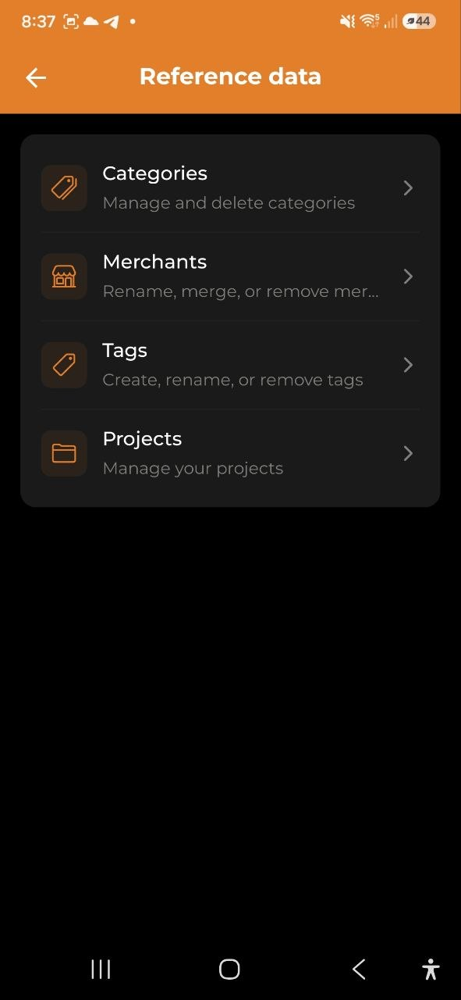

# Referenzdaten

> Kategorien, Händler, Tags und Projekte sind die Grundbausteine der Ausgabenorganisation. Verwalte sie alle an einem Ort: **Einstellungen → Referenzdaten**.

## Übersicht

Alle vier Typen von Referenzdaten werden an einem zentralen Ort in den Einstellungen verwaltet. Die Oberfläche ist einheitlich: **Zeile antippen zum Bearbeiten**, **+** zum Hinzufügen, **Mülleimer** zum Löschen.

> **Betrachter-Rolle**: Mitglieder mit Betrachter-Rolle können Referenzdaten ansehen, aber nicht hinzufügen, umbenennen oder löschen.

## Kategorien

Kategorien klassifizieren Ausgaben und Einnahmen. Jede hat einen Namen und eine Farbe.

- Tippe auf eine Kategorie zum Umbenennen oder Farbwechsel
- Tippe **+** bei „Ausgabenkategorien" oder „Einnahmenkategorien" um eine neue zu erstellen
- Tippe auf den Mülleimer um eine Kategorie zu löschen
  - Löschen ist gesperrt, wenn die Kategorie von aktiven Ausgaben oder Budgets verwendet wird
  - Systemkategorien können nicht gelöscht werden

## Händler

Händler werden automatisch erstellt wenn du Ausgaben hinzufügst. Der Händler-Bildschirm hilft beim Bereinigen von Duplikaten.

- Tippe auf einen Händler zum Umbenennen
- Umbenennen führt alle Ausgaben mit dem alten Namen unter dem neuen zusammen
- Löschen entfernt den Händlernamen aus allen passenden Ausgaben

> Händler können nicht manuell erstellt werden.

### Kategorieregeln

Die App lernt aus deinen Korrekturen. Jedes Mal, wenn du die Kategorie einer Ausgabe mit Händlernamen änderst, wird automatisch eine **Kategorieregel** gespeichert. Beim nächsten Import eines Kontoauszugs oder Wise-CSV wendet die App deine Regel an und weist die Kategorie automatisch zu.

- Erlernte Regeln erscheinen im Abschnitt **Kategorieregeln** unten auf dem Händler-Bildschirm
- Tippe auf den Mülleimer, um eine Regel zu löschen
- Regeln werden auf dem Server gespeichert und auf allen Geräten synchronisiert

## Tags

Tags ermöglichen die Kennzeichnung von Ausgaben mit freien Schlüsselwörtern.

- Tippe **+** um einen Tag zu erstellen (Name und Farbe wählen)
- Tippe auf einen Tag zum Umbenennen oder Farbwechsel
- Tippe auf den Mülleimer um den Tag zu entfernen

## Projekte

Projekte gruppieren Ausgaben nach Ziel oder Aktivität.

- Tippe **+** um ein Projekt zu erstellen (Name, Beschreibung, Farbe, optionales Budget)
- Tippe auf ein Projekt um den Detailbildschirm zu öffnen
  - Sieh alle verknüpften Ausgaben, Gesamtbetrag und verbleibendes Budget
  - Nutze das **Stift-Symbol** (oben rechts) zum Bearbeiten
  - Nutze das **Mülleimer-Symbol** (oben rechts) zum Löschen

---

*Siehe auch: [Ausgaben & Einnahmen](./03-expenses-and-income.md) | [Analysen](./06-analytics.md) | [Einstellungen](./11-settings.md)*
