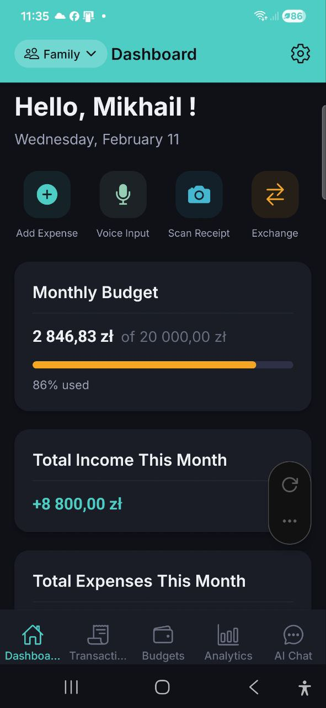
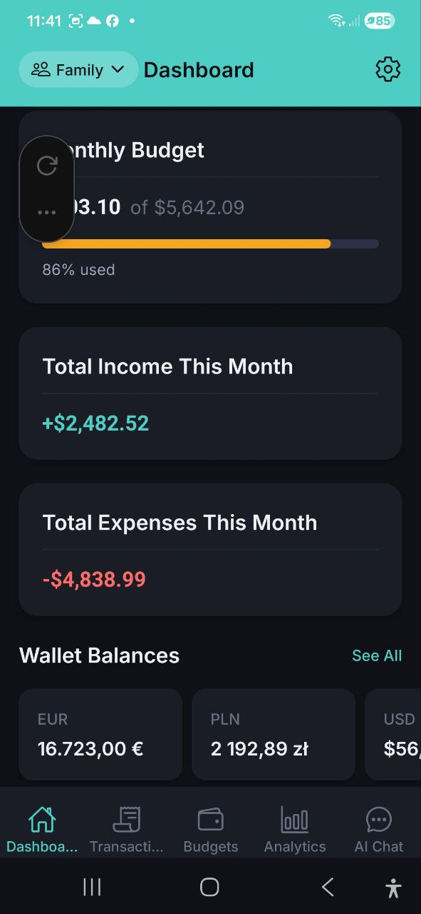

# Dashboard

> Your financial command center. See your budget status, income, expenses, and wallet balances at a glance, with quick actions to add expenses in one tap.

## Overview

The Dashboard is the first screen you see after logging in. It displays a personalized greeting, your current account context, and key financial metrics for the current month.

## Account Switcher

At the top-left corner, tap the account name (e.g., **Family**) to open the **Switch Account** dropdown. You can switch between your Personal, Shared, and Business accounts. All data on the Dashboard updates to reflect the selected account.

## Quick Actions

Four quick action buttons below the greeting give you fast access to the most common tasks:

| Button | Action |
|---|---|
| **Add Expense** | Opens the manual expense form |
| **Voice Input** | Opens the voice expense screen — speak your expense naturally |
| **Scan Receipt** | Opens the camera to photograph a receipt for AI extraction |
| **Exchange** | Opens the currency exchange form |

## Gamification Widget

Below the quick actions, a compact card shows your gamification progress:

- **Level** — your current level with an XP progress bar toward the next level
- **Streak** — your daily tracking streak count with a fire or snowflake emoji

Tap this card to open the full **Achievements** screen with all badges, streak details, and category filters.

> See [Achievements & Gamification](./13-gamification.md) for details on how XP, levels, and achievements work.

## Monthly Budget Card

- Shows your current spending against your monthly budget (e.g., **2 846,83 zl of 20 000,00 zl**)
- Color-coded progress bar: green (under control), yellow (approaching limit), red/orange (near or over budget)
- Displays **percentage used** (e.g., 86% used)
- Tap the card to navigate to the **Budgets** tab for details

> **Note:** If no monthly budget is set, you'll see a hint to create one.

## Total Income This Month

- Displays your total income for the current month in green (e.g., **+$2,482.52**)
- Tap to go to the **Transactions** tab (Income view)

## Total Expenses This Month

- Displays your total expenses for the current month in red (e.g., **-$4,838.99**)
- Tap to go to the **Transactions** tab (Expenses view)

## Wallet Balances

- Horizontal scrollable cards showing your balance in each currency (e.g., **EUR 16,723.00**, **PLN 2 192,89**, **USD $56...**)
- Tap **See All** to go to the full Wallet view with detailed breakdowns
- If no balances are set, you'll see a prompt to add your initial balance

## Pull to Refresh

Pull down anywhere on the Dashboard to refresh all data and sync with the server.

## FAQ

- **Q: Why does the Dashboard show $0 for everything?**
  **A:** You haven't added any expenses or income yet. Use the quick action buttons to add your first transaction.

- **Q: Can I customize what appears on the Dashboard?**
  **A:** The Dashboard layout is fixed, but it adapts to your data — wallet balances only appear after you set them up, and budget cards only appear with active budgets.

---

*See also: [Expenses & Income](./03-expenses-and-income.md) | [Wallet & Exchange](./10-wallet-and-exchange.md)*
