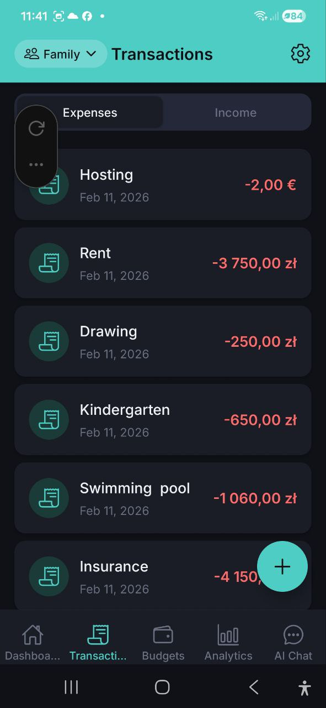
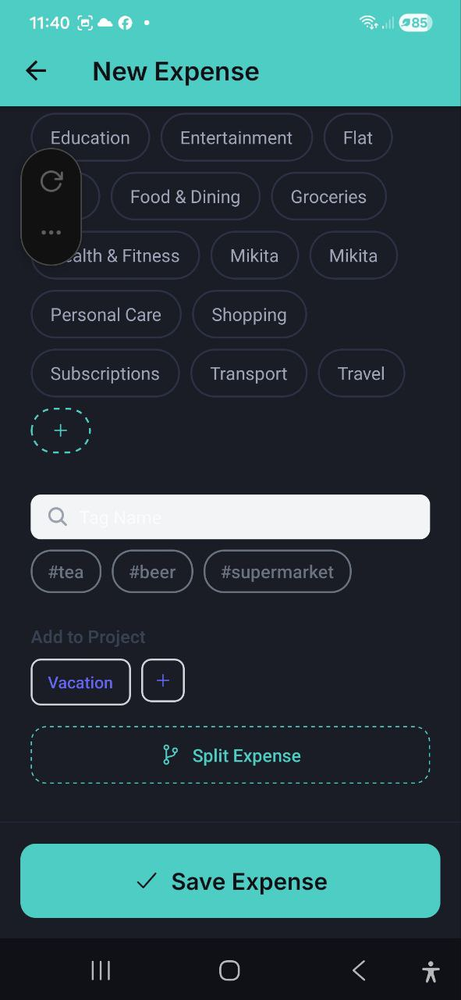

# Expenses & Income

> View, add, and manage all your transactions. Switch between Expenses and Income tabs, with support for multiple currencies, categories, tags, projects, and expense splits.

## Transaction List

The **Transactions** screen has two tabs at the top:
- **Expenses** — all your expenses, sorted by date (newest first)
- **Income** — all your income entries

Each transaction shows:
- Category icon
- Description (e.g., "Hosting", "Rent", "Kindergarten")
- Date
- Amount with currency, color-coded: red for expenses (e.g., **-3 750,00 zl**), green for income

Tap any transaction to view its full details.

### Quick Actions (Long Press)

Long-press any transaction in the list to open a quick action menu:
- **Edit** — open the transaction in edit mode
- **Duplicate** — create a new transaction pre-filled with the same data
- **Delete** — remove the transaction (with confirmation)

> **Note:** Duplicate and Delete are only available for account owners and editors.

Use the floating **+** button (bottom-right) to add a new transaction.

## Adding a New Expense (Manual)

### Step-by-step

1. Tap the **+** button on the Transactions screen, or **Add Expense** from the Dashboard
2. If using the **+** button, select **Manual Entry** from the menu
3. Tap the currency symbol to change currency (USD, EUR, PLN, GBP, UAH, RUB, BYN)
4. Enter the **amount**
5. Enter a **Description** (e.g., "What was this expense for?")
6. Select a **Category** from the chips:
   - Food & Dining, Groceries, Transport, Shopping, Entertainment, Health & Fitness, Bills & Utilities, Education, Travel, Coffee & Drinks, Subscriptions, Clothing, Personal Care
   - Tap the **+** button to create a custom category
7. Search and select **Tags** (e.g., #tea, #beer, #supermarket) — optional
8. Select **Add to Project** (e.g., "Vacation") — optional
9. Tap **Split Expense** to divide the expense across multiple categories — optional
10. Tap **Save Expense**

### Categories

The app provides 14 built-in expense categories. You can also create custom categories by tapping the **+** button in the category selector. Each category has a unique color for easy identification in charts and lists.

### Tags

Tags help you organize expenses with custom labels:
- Search for existing tags using the search field
- Select from recent or popular tags
- AI may suggest relevant tags based on your description
- Tags appear as chips (e.g., **#tea**, **#beer**, **#supermarket**)

### Projects

Link expenses to projects for grouped tracking:
- Select an existing project (e.g., **Vacation**)
- Tap **+** to create a new project
- View project spending totals in the Projects section
- Change or remove the project later — open the expense, tap **Edit**, then pick a different project or tap **Clear**

### Split Expense

Divide a single expense across multiple categories:
1. Tap **Split Expense** on the expense form
2. Add categories with amounts or percentages
3. The total must equal the original expense amount
4. Tap **Confirm Split**

> **Tip:** Use **Suggest Split** to let AI recommend how to divide the expense.

## Adding Income

### Step-by-step

1. Go to **Transactions** tab and switch to the **Income** tab
2. Tap the **+** button
3. Tap the currency symbol to select your currency
4. Enter the **amount**
5. Enter a **Description** (e.g., "What was this income for?")
6. Select a **Category**: Salary, Freelance, Investments, Gifts, or Other Income
7. Add optional **Notes**
8. Tap **Save Income**

## Expense Details

Tap any expense to view its full details:

- **Description** and amount with currency
- **Date** of the expense
- **Category** with color indicator
- **Notes** (if added)
- **Added by** — shown in shared accounts; displays the name of the account member who created this entry
- **Sync Status** — pending, synced, conflict, or error
- **Source** — Manual Entry, Voice Input, Receipt Scan, or Imported
- **Receipt Items** — individual items (for scanned receipts)
- **Receipt Image** — view, share, save to gallery, replace, or delete the receipt photo. PDF receipts show a document preview with tap-to-open. If no receipt is attached yet, tap **Attach Receipt** to add one — choose **Take Photo**, **Choose from Gallery**, or **Choose PDF**. Works for any expense, including ones added manually

### Actions on expense details:
- **Edit** — modify the expense
- **Copy** — create a duplicate
- **Delete** — remove the expense (with confirmation)

## Income Details

Tap any income entry to view details:
- Description, date, category, notes
- **Added by** — in shared accounts, shows who created this income entry
- Edit or delete options

## FAQ

- **Q: Can I add expenses in different currencies?**
  **A:** Yes! Tap the currency symbol on the expense form to switch between USD, EUR, PLN, GBP, UAH, RUB, and BYN.

- **Q: How do I edit an existing expense?**
  **A:** Tap the expense in the list to open details, then tap **Edit**.

- **Q: What's the difference between categories and tags?**
  **A:** Each expense has one category (e.g., "Food & Dining") but can have multiple tags (e.g., #lunch, #work). Categories are used for budgets and charts; tags provide additional filtering flexibility.

- **Q: Why does the Transactions tab open instantly, even with no internet?**
  **A:** The app stores your transactions locally on your device. When you open the tab, the list is shown immediately from this local copy, and any new changes from the server are loaded in the background. If the list is empty on first launch, you'll see a brief loading spinner while the device fetches your data.

---

*See also: [Voice Input & Receipt Scanning](./04-voice-and-receipt.md) | [Budgets](./05-budgets.md)*
