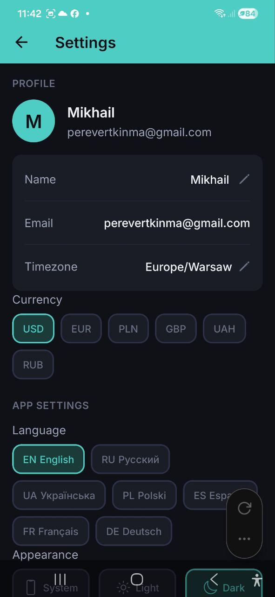
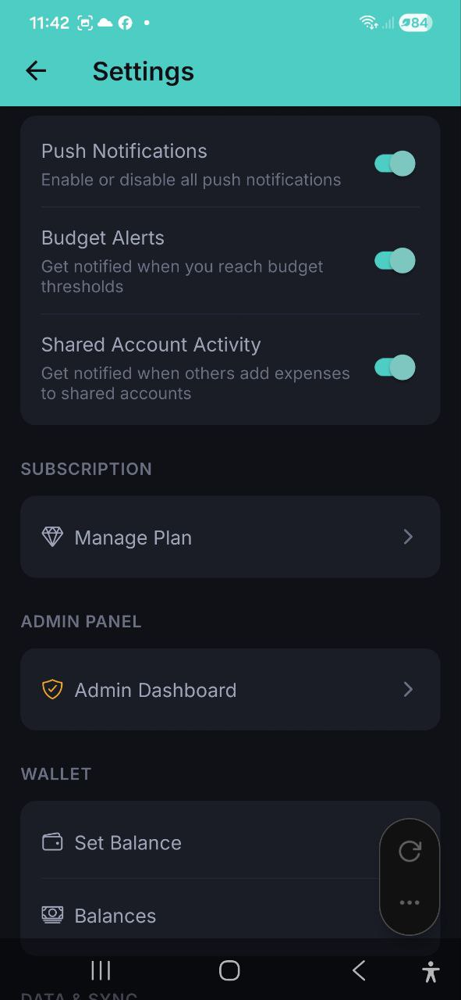

# Settings

> Customize your profile, appearance, notifications, and data sync. Change your language, currency, theme, and manage your account preferences.

## Overview

Access Settings by tapping the **gear icon** in the top-right corner of any screen.

## Profile

- **Avatar** — displays your initials with a colored background
- **Name** — your display name. Tap the pencil icon to edit
- **Email** — your account email (display only)
- **Timezone** — tap the pencil icon to change. A searchable picker appears with 90+ timezones (e.g., "Europe/Warsaw")

## Currency

Select your default currency by tapping one of the currency chips:

**USD** | **EUR** | **PLN** | **GBP** | **UAH** | **RUB**

The selected currency is highlighted. This sets the default currency for new expenses, income, and Dashboard displays.

## App Settings

### Language

Choose from 7 supported languages:

| Code | Language |
|---|---|
| EN | English |
| RU | Русский |
| UA | Українська |
| PL | Polski |
| ES | Espanol |
| FR | Francais |
| DE | Deutsch |

Tap a language chip to switch. The interface updates immediately.

### Appearance

Choose your theme:

- **System** — follows your device's light/dark mode setting
- **Light** — always use light theme
- **Dark** — always use dark theme

## Notifications

Toggle switches for notification preferences:

| Setting | Description |
|---|---|
| **Push Notifications** | Master toggle — enable or disable all push notifications |
| **Budget Alerts** | Get notified when you reach budget thresholds |
| **Shared Account Activity** | Get notified when others add expenses to shared accounts |

## Subscription

- **Manage Plan** — tap to view your current subscription and explore upgrade options

## Admin Panel

- **Admin Dashboard** — visible only to admin users. Provides system-level statistics and AI usage monitoring.

## Wallet

Quick access to wallet features:

- **Set Balance** — set initial balances for your currencies
- **Balances** — view detailed wallet breakdown by currency

## Data & Sync

- **Last Synced** — shows when your data was last synced with the server (e.g., "5 min ago" or "Never")
- **Sync Now** — tap to manually trigger a data sync

> **Note:** The app works offline. Your data saves to your device and automatically syncs when you're back online. Use **Sync Now** to force an immediate sync.

## Log Out

Scroll to the bottom of Settings and tap **Log Out**. A confirmation dialog will appear — confirm to sign out of your account.

## FAQ

- **Q: I changed my language but some text is still in the old language. What do I do?**
  **A:** The language change is instant for all interface elements. If you notice untranslated text, try restarting the app.

- **Q: How do I change my email?**
  **A:** Email changes are not supported in the app currently. Contact support for assistance.

- **Q: What happens to my data when I log out?**
  **A:** Your data remains stored on the server. When you log back in, everything will be restored. Local data on the device may be cleared.

---

*See also: [Accounts](./09-accounts.md) | [Subscription Plans](./12-subscription.md)*
