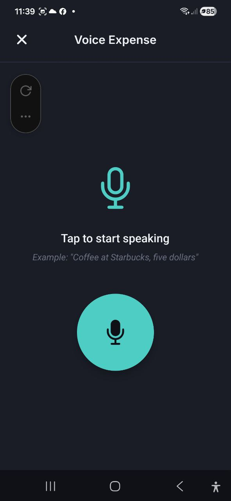
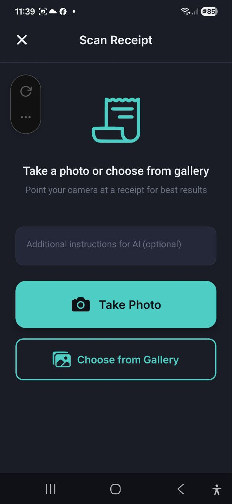

# Entrada de voz y Escaneo de recibos

> Deja que la IA haga el trabajo. Describe tu gasto de forma natural o fotografa un recibo — la aplicacion extrae el importe, la descripcion, el comercio y la categoria automaticamente.

## Gasto por voz

### Como funciona

1. Toca **Entrada de voz** desde las acciones rapidas del Panel, o toca **+** en la pantalla de Transacciones y selecciona **Entrada de voz**
2. Veras un icono grande de microfono con el texto **"Toca para comenzar a hablar"**
3. Toca el boton del microfono para empezar a grabar
4. Habla de forma natural, por ejemplo: *"Cafe en Starbucks, cinco dolares"*
5. Toca de nuevo para detener la grabacion
6. La aplicacion procesa tu voz y extrae los detalles del gasto

### Pantalla de confirmacion

Despues del procesamiento, veras una confirmacion con los datos extraidos:

- **Importe** — extraido de tu voz (editable)
- **Descripcion** — para que fue el gasto (editable)
- **Comercio** — donde gastaste (editable)
- **Categoria** — asignada automaticamente (editable)
- Indicador de **Confianza** — **Alta confianza** o **Confianza media**

Revisa los detalles, realiza las correcciones necesarias y luego:
- Toca **Guardar gasto** para confirmar y guardar
- Toca **Intentar de nuevo** para volver a grabar

Despues de guardar, puedes tocar **Agregar otro** para grabar un nuevo gasto por voz.

### Consejos para mejores resultados

- Habla con claridad e incluye tanto el articulo/descripcion como el importe
- Incluye el nombre del comercio si es relevante (por ejemplo, "Almuerzo en McDonald's, doce euros")
- Especifica la moneda si es diferente a la predeterminada
- Mantenlo simple — un gasto por grabacion

## Escanear recibo

### Como funciona

1. Toca **Escanear recibo** desde las acciones rapidas del Panel, o toca **+** en la pantalla de Transacciones y selecciona **Escanear recibo**
2. Veras tres opciones:
   - **Tomar foto** — abre tu camara para fotografiar el recibo
   - **Elegir de la galeria** — selecciona una foto existente
   - **Subir PDF** — elige un archivo PDF (facturas digitales, recibos escaneados, hasta 10 MB)
3. Opcionalmente, introduce **Instrucciones adicionales para la IA** (por ejemplo, "Dividir a partes iguales entre dos personas", "Ignorar la propina")
4. La aplicacion analiza el recibo y extrae los datos

### Pantalla de confirmacion

Despues del analisis de la IA, veras:

- **Importe total** — extraido del recibo (editable)
- **Descripcion** — resumen generado (editable)
- **Comercio** — nombre de la tienda/restaurante (editable)
- **Categoria** — asignada automaticamente (editable)
- **Fecha** — del recibo (editable)
- **Articulos** — articulos individuales con cantidades y precios (si se detectan) — toca cualquier articulo para editarlo, eliminarlo o anadir uno que el escaneo paso por alto (ver **Editar articulos** mas abajo)
- **Descuento** — importe del descuento (si esta presente en el recibo)
- Indicador de **Confianza** — **Alta confianza** o **Confianza media**
- Interruptor **Guardar imagen del recibo** — mantener la foto adjunta al gasto

Revisa y corrige cualquier detalle, luego:
- Toca **Guardar gasto** para confirmar
- Toca **Escanear de nuevo** para probar con otra foto

### Consejos para mejores resultados

- Fotografa con buena iluminacion — evita sombras y reflejos
- Asegurate de que el recibo completo sea visible y este plano
- Mantene la camara estable para evitar desenfoque
- Usa **Instrucciones adicionales para la IA** para un tratamiento especial (por ejemplo, "Esto esta en EUR", "Ignorar el primer articulo")

### Editar artículos

La extracción por IA no siempre es perfecta: puede faltar una cifra en el precio, un descuento puede colarse en el precio unitario, o el escaneo puede pasar por alto una línea entera. No hace falta volver a escanear ni borrar todo el gasto para corregirlo:

- **Toca cualquier artículo** de la lista para editar su nombre, cantidad, precio unitario o precio total. Toca **Guardar** para aplicar la corrección.
- **Toca el icono de papelera** junto a un artículo para eliminarlo — útil para una línea duplicada o inventada.
- **Toca + Añadir artículo** al final de la lista para añadir una línea que el escaneo pasó por alto.

Se muestran todos los artículos, sin límite, sean los que sean los que tenga el recibo. Cualquier cambio actualiza de inmediato la división por categorías y los totales, así que lo que guardas siempre coincide con lo que ves en pantalla. El importe total, el descuento y el depósito del recibo se mantienen tal como se escanearon — solo los artículos individuales son editables.

### División por categorías

Los recibos del supermercado a menudo mezclan varios tipos de artículos en una sola compra — alimentos, artículos del hogar, alcohol. Cuando la aplicación reconoce más de un tipo de artículo en un recibo, divide automáticamente el gasto entre las categorías correspondientes en lugar de asignarlo todo a una sola.

- En la pantalla de confirmación aparece una fila de chips de categoría sobre la lista de artículos, etiquetada **Dividir por categoría** (por ejemplo, "Alimentación 180 · Hogar 35 · Alcohol 25"), que muestra cómo se desglosará el importe total.
- Toca **Cambiar categorías** para abrir una lista de todos los artículos y ajustar a qué categoría pertenece cada uno. Tus cambios se aplican de inmediato — y se recuerdan, de modo que el mismo producto se categoriza correctamente la próxima vez que lo escanees.
- Si los artículos no suman lo suficientemente cerca del importe total del recibo, la aplicación recurre a una sola categoría en lugar de adivinar.
- Los depósitos de botellas y latas se reconocen y se muestran como su propia categoría, para que puedas ver cuánto de tu gasto es envase que puedes recuperar.
- Esto también cuenta ahora para tus presupuestos por categoría — un presupuesto de una categoría que solo aparece dentro de una división de recibo, como Alcohol o el depósito, por fin se contabiliza correctamente, y un presupuesto de Alimentación deja de contar los artículos del hogar o el depósito del mismo recibo.
- A veces ninguna de tus categorías existentes encaja con un grupo de artículos. En ese caso, la aplicación sugiere una categoría totalmente nueva, mostrada como un chip marcado con un **+** (por ejemplo, "+ Productos de limpieza 10"). Todavía no se crea — toca **Cambiar categorías** para reasignar sus artículos a una categoría existente, o dejarla tal como se sugirió. La nueva categoría solo se crea de verdad cuando guardas el recibo.

Funciona igual tanto si escaneas desde la aplicación como desde los bots de Telegram, WhatsApp o Slack.

### Escanear una pila de recibos

¿Tienes acumulada una semana de recibos en papel? Después de guardar uno, la confirmación te ofrece dos opciones en lugar de simplemente cerrar la pantalla:

- **Escanear otro** — vuelve directamente a la cámara sin salir de la pantalla, para que puedas resolver toda una pila uno tras otro
- **Listo** — termina y te devuelve a donde empezaste

Mientras escaneas, un pequeño contador muestra cuántos recibos has guardado en esta sesión. Cada 15 recibos, la app te avisa con un recordatorio amistoso de que puedes seguir o tomar un descanso — tu progreso ya está guardado de cualquier forma. El contador se reinicia al salir de la pantalla; solo está para darte una sensación de progreso durante una sesión.

### Recibos ya escaneados

La app te avisa antes de que un recibo acabe dos veces en tus gastos:

- **El mismo archivo otra vez** — si eliges una foto o un PDF que ya se escaneó y guardó, se te pregunta *antes* de leerlo, así que no se gasta ninguna solicitud de IA. **Abrir** muestra el gasto guardado, **Escanear igualmente** lo vuelve a leer y **Cancelar** lo cancela.
- **El mismo recibo, foto nueva** — si tras leerlo ya existe un gasto con la misma tienda, importe y fecha (±1 día), la pantalla de confirmación muestra un aviso amarillo con un botón **Abrir**. Aun así puedes guardarlo: puede ser una segunda compra real.
- **Ya registrado por tu banco** — si el gasto coincidente vino de una notificación del banco o de un extracto importado, el aviso lo indica y ofrece **Unir en un solo gasto**. Con la casilla marcada, al guardar se conserva el recibo (artículos, foto y categoría) y se sustituye la entrada del banco, así la compra cuenta una sola vez. Si solo coinciden el importe y la fecha, la casilla empieza desmarcada: compruébalo antes de unir.

Los bots de Telegram, WhatsApp y Slack avisan igual y ofrecen un botón **Escanear igualmente**.

### Compartir desde otra app (Android)

¿Tienes un recibo como captura de pantalla, una confirmación de la app del banco o un recibo electrónico en PDF? No hace falta abrir el escáner:

1. En cualquier app (galería, Gmail, tu banco, la app de una tienda), toca **Compartir**
2. Elige **AI Budget**
3. La app se abre directamente en la pantalla de confirmación ya rellenada: revísala y toca **Guardar**

Puedes compartir **imágenes y PDF**, hasta **10 archivos a la vez** (PDF de hasta 10 MB). Varios archivos se convierten en gastos separados, uno tras otro: el título muestra el progreso («Recibo 2 de 5») y **Siguiente** pasa al archivo siguiente. Si un archivo no se puede leer, elige **Omitir** o **Introducir a mano**. Al cerrar la pantalla, la app pregunta antes de descartar los archivos pendientes. Cada archivo cuenta como un escaneo de recibo en tu límite de IA; si se agota, los archivos restantes quedan para más tarde.

Compartir solo funciona en Android. En iPhone y en la app web usa **Escanear recibo**.

### Reenviar e-recibos por correo

Muchas tiendas físicas y online te envían un recibo o una confirmación de pedido por correo. En lugar de escanearlo, puedes reenviarlo a tu propia dirección privada: cada correo reenviado aparece en la app como un gasto que espera tu confirmación. **No se guarda nada hasta que lo confirmas.**

> **Se está activando poco a poco.** Si ves **Recibos por e-mail** en **Ajustes**, ya puedes usarla. Si todavía no la ves, aún no ha llegado a tu cuenta.

#### Tu dirección

1. Abre **Ajustes** → **Recibos por e-mail**
2. Toca **Crear mi dirección** (solo los propietarios y editores de la cuenta pueden hacerlo)
3. En **Tu dirección privada**, toca **Copiar**
4. En **Añadir recibos a**, elige la cuenta donde se guardan los recibos confirmados (solo aparecen las cuentas que puedes editar)

La dirección es tuya, no de la cuenta: los miembros de una cuenta compartida nunca ven los correos que reenvías.

#### Configurar el reenvío en Gmail

1. En Gmail abre **Configuración** → **Ver toda la configuración** → **Reenvío y correo POP/IMAP** → **Añadir una dirección de reenvío** y pega tu dirección privada
2. Gmail envía un código de confirmación a esa dirección. Aparece en la app, en **Ajustes** → **Recibos por e-mail**, en una tarjeta **Código de confirmación de Gmail** con un botón **Copiar**. Introdúcelo en Gmail. El código solo se muestra en la app —nunca en una notificación— y solo durante unos 30 minutos; si ya no está, pide a Gmail que lo envíe de nuevo
3. Crea un **filtro** (**Configuración** → **Filtros y direcciones bloqueadas**) para la dirección del remitente de la tienda o un asunto como «recibo» o «pedido», y elige **Reenviarlo a** tu dirección

No reenvíes todo tu correo: usa un filtro, por tu privacidad y para que los mensajes ajenos no gasten tu límite de IA.

#### Configurar el reenvío en Outlook

1. En Outlook abre **Configuración** → **Correo** → **Reglas** y añade una regla para los mensajes de la tienda o con «recibo» en el asunto
2. Elige la acción **Reenviar a** e introduce tu dirección privada

Algunas cuentas de Outlook.com y Microsoft 365 bloquean el reenvío automático a direcciones externas. Si es tu caso, reenvía cada recibo manualmente: un reenvío manual desde el móvil funciona igual.

#### Confirmar un recibo

Cuando se ha leído un recibo reenviado, recibes una notificación y aparece un aviso en la pantalla de Transacciones: **Recibos por e-mail por confirmar: N**. También puedes abrir la lista en cualquier momento desde **Ajustes** → **Recibos por e-mail** → **Abrir la bandeja de recibos por e-mail**.

- La pestaña **Por confirmar** muestra los recibos que te esperan. Toca uno para abrir la pantalla habitual de confirmación del recibo, revisa los datos y toca **Guardar gasto**
- Si el recibo parece un gasto que ya tienes, verás el mismo aviso de duplicado que al escanear, incluido **Unir en un solo gasto**
- Toca **Descartar** para desechar un recibo sin guardarlo
- La pestaña **Gestionados** muestra lo que se omitió: un recibo que ya tienes, un correo sin recibo, uno que no se pudo leer o uno sin leer porque se alcanzó tu límite de IA; cuando corresponda, toca **Reintentar**

Cada e-recibo leído cuenta como un escaneo de recibo en tu límite de IA; los duplicados y los correos sin recibo se omiten sin gastarlo. Si una tienda solo envía un enlace al recibo, reenvía el PDF: los enlaces nunca se abren. Una foto del recibo se puede guardar con el gasto; un PDF o un correo de texto no se adjuntan. La lista necesita conexión a internet.

#### Si tu dirección se filtra

Toca **Cambiar dirección**. La dirección actual deja de funcionar al instante y el correo enviado a ella se rechaza. Después cambia la regla de reenvío de tu buzón a la nueva dirección (Gmail volverá a pedir un código de confirmación). Para dejar de recibir e-recibos por completo, toca **Desactivar dirección**.

#### Privacidad y conservación

- Nuestro servidor lee el correo reenviado mientras lo procesa, igual que cualquier recibo que escaneas
- Solo se guarda el recibo, nunca el correo completo. Los enlaces del correo nunca se abren y sus imágenes nunca se cargan
- El recibo guardado se elimina en cuanto lo confirmas o descartas; los elementos sin confirmar se eliminan automáticamente a los 30 días
- Los recibos por e-mail **no están disponibles** en cuentas con **Nivel 2 — Cifrado completo**. Con el cifrado de Nivel 1 funcionan, pero los elementos sin confirmar se eliminan a los 7 días. Consulta [Cifrado](./15-encryption.md)

## Ingresos por voz

Registra los pagos recibidos por voz — el mismo flujo que Gasto por voz, optimizado para ingresos.

### Cómo funciona

1. Toca **Ingresos por voz** desde las acciones rápidas del Panel, o toca el icono del micrófono en el pie del formulario **Agregar ingreso**
2. Toca el botón (verde) del micrófono para empezar a grabar
3. Habla de forma natural, por ejemplo: *"Recibidos 500 del cliente, honorarios de consultoría"*
4. Toca de nuevo para detener la grabación
5. La aplicación extrae el importe, la descripción y la **categoría de ingreso** más adecuada

### Pantalla de confirmación

- **Importe** — extraído de tu voz (editable)
- **Descripción** — para qué fue el pago (editable)
- **Categoría** — categoría de ingreso asignada automáticamente (editable)
- **Moneda** — detectada o establecida por defecto en tu moneda base

Toca **Guardar ingreso** para confirmar, o **Intentar de nuevo** para volver a grabar.

### Consejos para mejores resultados

- Menciona el importe y una breve descripción
- Especifica la moneda si difiere de tu moneda predeterminada

---

## Escanear factura

Fotografía o sube una factura o documento de pago para capturar ingresos automáticamente.

### Cómo funciona

1. Toca **Escanear factura** desde las acciones rápidas del Panel, o toca el icono del documento en el pie del formulario **Agregar ingreso**
2. Elige **Tomar foto**, **Elegir de la galería** o **Subir PDF**
3. Opcionalmente, introduce instrucciones adicionales para la IA
4. La aplicación extrae el importe total, la fecha y la categoría

### Pantalla de confirmación

- **Importe total** — extraído del documento
- **Descripción** — resumen generado
- **Categoría** — categoría de ingreso asignada automáticamente
- **Fecha** — del documento

Revisa los detalles, toca ✓ para guardar o el icono del lápiz para abrir el formulario completo de Agregar ingreso con los datos pre-rellenados.

> **Nota:** El OCR de facturas extrae únicamente el total y la fecha. Los elementos de línea de las facturas se ignoran intencionalmente para evitar el doble conteo en documentos de facturación de varias líneas.

---

## Preguntas frecuentes

- **P: Que idiomas admite la entrada de voz?**
  **R:** La entrada de voz funciona mejor en el idioma configurado en la aplicacion. Admite los 8 idiomas de la aplicacion.

- **P: Puedo escanear recibos en cualquier idioma?**
  **R:** Si, la IA puede procesar recibos en la mayoria de los idiomas y extraera importes y articulos independientemente del idioma del recibo.

- **P: Que archivos PDF son compatibles?**
  **R:** Se admiten tanto PDFs digitales (por ejemplo, facturas de Amazon o PayPal) como recibos escaneados en PDF. El tamano maximo del archivo es 10 MB. Los PDFs digitales con texto seleccionable se procesan mas rapido y con mayor precision. Para PDFs escaneados, asegurate de que el escaneo sea nitido y de alto contraste.

- **P: Por que el importe fue incorrecto despues del escaneo?**
  **R:** La extraccion por IA no siempre es perfecta. Revisa siempre la pantalla de confirmacion y corrige cualquier error antes de guardar. Los recibos borrosos o danados pueden producir resultados menos precisos. Si un articulo concreto esta mal, tocalo para editarlo directamente — consulta **Editar artículos** más arriba.

- **P: La entrada de voz o el escaneo de recibos consume mis solicitudes IA?**
  **R:** Si, cada entrada de voz o escaneo de recibo utiliza una solicitud IA de tu cuota mensual.

- **P: ¿Por qué un recibo terminó dividido en varias categorías en mis gráficos?**
  **R:** Cuando un recibo mezcla claramente distintos tipos de artículos (por ejemplo, alimentación y alcohol), la aplicación lo divide automáticamente entre las categorías correspondientes en tus gráficos de gasto — y también en tus presupuestos por categoría. Toca **Cambiar categorías** en la pantalla de confirmación del recibo para ajustarlo — las correcciones se recuerdan para la próxima vez.

---

*Ver tambien: [Gastos e Ingresos](./03-expenses-and-income.md) | [Chat IA](./07-ai-chat.md)*
