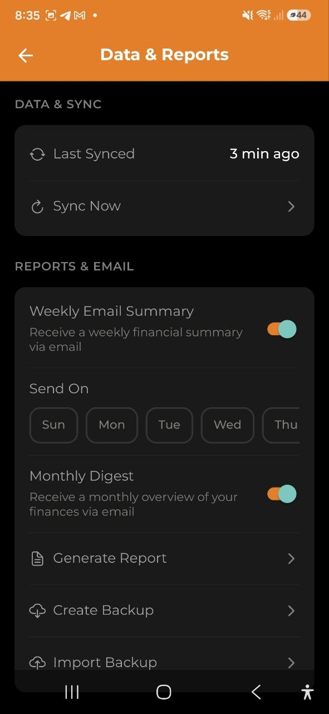

# Exportacion e informes

> Genera informes PDF, Excel y CSV de tus finanzas. Consulta resumenes de gasto mensual, crea copias de seguridad cifradas y recibe resumenes automaticos por email.

## Vista general

La pantalla **Exportacion e informes** te permite generar informes financieros, ver resumenes mensuales, descargar/compartir informes y gestionar copias de seguridad de datos. Accede a ella desde la pestana Analisis mediante el boton **Exportar informe**, o desde **Ajustes** > **Informes y email** > **Generar informe**.

## Formatos de informe

Tres formatos de exportacion disponibles:

| Formato | Descripcion | Disponibilidad |
|---|---|---|
| **CSV** | Valores separados por comas, compatible con Excel y Google Sheets | Todos los planes |
| **PDF** | Informe formateado con resumen, desglose por categoria y lista de transacciones | Pro y Business |
| **Excel** | Libro de trabajo con varias hojas: Resumen, Gastos e Ingresos | Pro y Business |

## Generar un informe

1. Selecciona un **formato** (CSV, PDF o Excel)
2. Elige un **periodo de tiempo** (Ultima semana, Este mes, Ultimo trimestre, Este ano)
3. Toca **Generar**
4. El informe se genera y se abre inmediatamente mediante el dialogo para compartir del sistema — guardalo o envialo desde ahi
5. El informe tambien aparece en **Informes recientes** para acceder mas tarde

Los informes se almacenan durante 7 dias y luego se eliminan automaticamente.

## Resumen mensual (Pro+)

Una instantanea de tu actividad financiera del mes actual:

- **Ingresos totales** y **Gastos totales**
- **Tasa de ahorro** — porcentaje de ingresos ahorrados
- **Categorias principales** — tus categorias de mayor gasto con importes
- Los datos se almacenan en cache durante 7 dias y se actualizan automaticamente

## Informes recientes

Una lista de tus informes generados recientemente que muestra:

- Icono de formato (CSV/PDF/Excel)
- Nombre del archivo y fecha de creacion
- Tamano del archivo
- Boton **Descargar** — guarda el archivo directamente en tu dispositivo (Android: elige carpeta via SAF; iOS: guardar en Archivos)
- Boton **Compartir** — abre la hoja del sistema para enviar el informe por email, mensajeria u otras apps

## Copia de seguridad de datos

Disponible en **todos los planes**:

- **Exportar copia de seguridad** — crea una copia de seguridad JSON completa de los datos de tu cuenta (gastos, ingresos, presupuestos, categorias, etiquetas, proyectos, billeteras, etc.)
  - **Donde se guarda el archivo:** En Android se abre un selector de carpetas y la copia se escribe en la carpeta que elijas; despues la app te muestra la ruta exacta. Si omites el selector (o en iOS), se abre el menu del sistema para compartir, de modo que puedas "Guardar en Archivos", Descargas o una unidad en la nube. El mensaje de exito solo aparece cuando el archivo se ha guardado o compartido realmente.
- **Restaurar copia de seguridad** — importa una copia de seguridad exportada previamente
- Si el cifrado esta activado, los campos cifrados se incluyen tal cual en la copia de seguridad

Accede a la copia de seguridad desde **Ajustes** > **Informes y email**.

## Informes por email

Resumenes automaticos por email entregados en tu bandeja de entrada:

| Funcion | Descripcion | Plan requerido |
|---|---|---|
| **Resumen semanal por email** | Vision general del gasto semanal con principales categorias | Business |
| **Resumen mensual por email** | Resumen mensual con comparacion mes a mes | Pro y Business |

Configuralos en **Ajustes** > **Informes y email**:

- Activa/desactiva los emails semanales/mensuales
- Elige el dia de la semana para informes semanales (lunes por defecto)

## Cifrado e informes

- **Nivel 0** (sin cifrado) — todos los datos se muestran correctamente en los informes
- **Nivel 1** (cifrado de texto) — los importes se muestran correctamente; los nombres de categorias y descripciones pueden aparecer vacios en informes generados por el servidor. El resumen mensual resuelve los nombres de categorias desde los datos locales de tu dispositivo
- **Nivel 2** (cifrado completo) — los informes no estan disponibles (los importes estan cifrados en el servidor)

## Preguntas frecuentes

- **P: Por que veo nombres de categorias vacios en mi informe PDF?**
  **R:** Si tienes E2EE activado (Nivel 1), los nombres de categorias estan cifrados en el servidor. El informe generado por el servidor no puede descifrarlos. Los importes siguen siendo precisos.

- **P: Cuanto tiempo se almacenan los informes?**
  **R:** Los informes se eliminan automaticamente despues de 7 dias. Descargalos inmediatamente despues de generarlos.

- **P: Puedo exportar datos de una cuenta compartida?**
  **R:** Si, cualquier miembro de la cuenta puede generar informes y copias de seguridad para la cuenta compartida.

- **P: Que se incluye en una copia de seguridad?**
  **R:** Todo: gastos, ingresos, presupuestos, categorias, etiquetas, proyectos, billeteras, transferencias e intercambios de moneda para la cuenta actual.

---

*Ver tambien: [Analisis](./06-analytics.md) | [Ajustes](./11-settings.md) | [Planes de suscripcion](./12-subscription.md) | [Cifrado](./15-encryption.md)*
