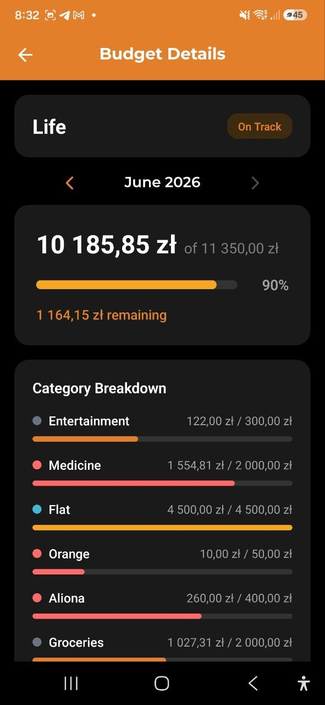

# Budgets

> Définissez des limites de dépenses et suivez votre progression en temps réel. Créez des budgets par catégorie ou répartissez votre budget sur plusieurs catégories, avec des périodes personnalisables et des seuils d'alerte automatiques.

## Aperçu

Les budgets vous aident à contrôler vos dépenses en définissant des limites pour des périodes spécifiques. L'application suit vos dépenses par rapport à ces limites et vous avertit lorsque vous approchez ou dépassez votre budget.

## Liste des budgets

L'onglet **Budgets** affiche tous vos budgets actifs :

- **Nom du budget** et période (Quotidien, Hebdomadaire, Mensuel, Annuel, Personnalisé)
- **Barre de progression** — indicateur visuel des dépenses par rapport à la limite
- **Montant dépensé** sur le budget total (par ex. "2 846 zl sur 20 000 zl")
- **Badge de statut** :
  - **En bonne voie** (vert) — les dépenses restent dans la limite
  - **Budget dépassé** (rouge) — les dépenses ont excédé la limite
- Montant **restant** ou dépassement

> **Note :** Si vous n'avez pas encore de budgets, vous verrez un message : "Créez un budget pour commencer à suivre vos limites de dépenses."

## Créer un budget

### Étape par étape

1. Appuyez sur **Créer un budget** dans l'onglet Budgets (ou le bouton **+**)
2. Entrez un **Nom de budget** (par ex. "Courses mensuelles")
3. Sélectionnez la **Devise**
4. Choisissez un **Mode de budget** :
   - **Global** — un montant total unique, optionnellement lié à une catégorie
   - **Par catégories** — répartissez le budget sur plusieurs catégories, chacune avec sa propre limite
5. Entrez le **Montant** (mode Global) ou ajoutez des catégories avec des montants (mode Par catégories)
6. Choisissez une **Période** :
   - **Quotidien** — se réinitialise chaque jour
   - **Hebdomadaire** — se réinitialise chaque semaine
   - **Mensuel** — se réinitialise chaque mois
   - **Annuel** — se réinitialise chaque année
7. Définissez le seuil **Alerte à** (par défaut : 80 %) — vous serez averti lorsque les dépenses atteindront ce pourcentage
8. Appuyez sur **Créer un budget**

### Mode « Par catégories »

En mode **Par catégories**, vous pouvez attribuer une limite de dépenses à chaque catégorie :

- Appuyez sur **Ajouter une catégorie** pour choisir une catégorie dans la liste
- Entrez le montant pour chaque catégorie
- Le budget total est égal à la somme de tous les montants par catégorie
- Vous pouvez ajouter autant de catégories que nécessaire

## Détails du budget

Appuyez sur un budget pour voir ses détails complets :

- **Visualisation de la progression** — barre montrant les dépenses par rapport à la limite
- **Statut** — En bonne voie ou Budget dépassé
- **Répartition par catégories** — pour les budgets multi-catégories, la progression de chaque catégorie :
  - Point de couleur + nom de catégorie
  - Dépensé / alloué
  - Barre de progression par catégorie (vert/jaune/rouge)
- **Période** — la plage temporelle du budget
- **Seuil d'alerte** — le point de déclenchement de la notification (par ex. 80 %)
- **Jours restants** — combien de jours restent dans la période en cours
- **Total projeté** — estimation des dépenses totales à la fin de la période
- **Actif/Inactif** — statut actuel du budget

### Actions :
- **Modifier** (icône crayon) — modifier le nom, le montant, les catégories, la période ou le seuil d'alerte
- **Supprimer** — supprimer le budget (avec confirmation)

## Historique des dépenses

La carte **Historique** affiche votre respect du budget sur les 6 dernières périodes. Disponible pour tous les types de période sauf Personnalisé.

- **Graphique en barres** — chaque groupe montre deux barres : vos dépenses réelles (colorées) et la limite du budget (grise) pour cette période.
  - Barre verte — dépenses dans la limite
  - Barre rouge — limite dépassée
- **Résumé de conformité** — par ex. « Dépassé 3 sur 6 périodes » ou « Économie moy. : 42 € »
- **Dépassement moyen** — si la limite a été dépassée sur certaines périodes, affiche le montant moyen de dépassement

> **Conseil :** Utilisez la carte historique pour repérer les dépassements récurrents. Si vous voyez 3 à 4 barres rouges consécutives, envisagez d'augmenter la limite ou d'ajuster vos habitudes dans cette catégorie.

## Modifier un budget

Appuyez sur l'**icône crayon** sur l'écran de détails du budget pour passer en mode édition :

- Modifier le nom du budget, la devise, la période ou le seuil d'alerte
- Basculer entre les modes **Global** et **Par catégories**
- En mode Par catégories : ajouter, supprimer ou modifier les montants des catégories
- Appuyez sur **Enregistrer** pour appliquer les modifications, ou **Annuler** pour les ignorer

## Alertes de budget

L'application surveille automatiquement vos budgets et envoie des notifications :

- **Alerte de seuil** — lorsque les dépenses atteignent votre pourcentage d'alerte défini (par ex. 80 %)
- **Alerte de dépassement** — lorsque les dépenses dépassent 100 %
- La couleur de la barre de progression change dynamiquement :
  - Vert — moins de 80 % utilisé
  - Jaune/Orange — 80–100 % utilisé
  - Rouge — plus de 100 % utilisé

> **Astuce :** La carte Budget mensuel sur le Tableau de bord affiche l'état de votre budget principal en un coup d'œil.

## FAQ

- **Q : Puis-je avoir plusieurs budgets en même temps ?**
  **R :** Oui ! Vous pouvez créer autant de budgets que nécessaire — pour différentes catégories, périodes ou l'ensemble de vos dépenses.

- **Q : Quelle est la différence entre les modes Global et Par catégories ?**
  **R :** Global définit une limite totale unique (optionnellement pour une catégorie). Par catégories permet de fixer des limites individuelles pour chaque catégorie — utile quand vous voulez suivre séparément l'alimentation, le transport et les loisirs au sein d'un même budget.

- **Q : Que se passe-t-il lorsqu'une période de budget se termine ?**
  **R :** Le budget se réinitialise automatiquement pour la nouvelle période. Vos données de dépenses précédentes sont conservées dans les Analyses.

- **Q : Le budget suit-il les dépenses dans toutes les devises ?**
  **R :** Chaque budget est lié à une devise. Seules les dépenses dans cette devise sont comptabilisées dans le budget.

---

*Voir aussi : [Tableau de bord](./02-dashboard.md) | [Analyses](./06-analytics.md)*
