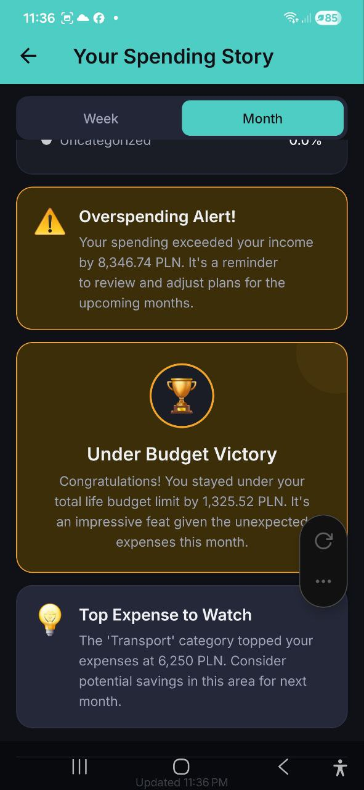

# Histoire des depenses

> Obtenez un rapport narratif de vos finances genere par l'IA. Decouvrez vos realisations, alertes et aperçus presentes sous forme d'une histoire visuelle captivante.

## Apercu

La fonctionnalite **Histoire des depenses** cree un rapport personnalise, sous forme de recit, de votre activite financiere. Elle met en avant les evenements cles, les realisations et les points de vigilance dans un format de cartes facile a lire.

## Comment y acceder

- Depuis l'onglet **Analyses**, appuyez sur la banniere **Voir votre histoire des depenses**
- L'histoire se genere automatiquement en fonction de la periode selectionnee

## Selection de la periode

En haut de l'ecran Histoire des depenses :

- **Semaine** -- histoire sur les finances de la semaine en cours
- **Mois** -- histoire sur les finances du mois en cours

Appuyez pour basculer entre les vues. Le contenu de l'histoire se met a jour en consequence.

## Blocs de l'histoire

L'IA genere differents types de blocs d'aperçus :

### Alerte de depenses excessives (Avertissement)
- Carte jaune avec icone d'avertissement
- Apparait lorsque vos depenses depassent vos revenus
- Exemple : *"Vos depenses ont depasse vos revenus de 8 346,74 PLN. C'est un rappel pour revoir et ajuster vos plans pour les mois a venir."*

### Victoire sous le budget (Realisation)
- Carte doree avec icone de trophee
- Apparait lorsque vous etes reste sous la limite d'un budget
- Exemple : *"Felicitations ! Vous etes reste sous votre budget total de 1 325,52 PLN. C'est un exploit impressionnant compte tenu des depenses imprevues ce mois-ci."*

### Principale depense a surveiller
- Carte bleue avec icone d'ampoule
- Met en avant votre categorie de depenses la plus elevee
- Exemple : *"La categorie 'Transport' a domine vos depenses a 6 250 PLN. Envisagez des economies potentielles dans ce domaine pour le mois prochain."*

### Elements supplementaires de l'histoire
- **Repartitions par categorie** avec pourcentages
- **Recits de synthese** decrivant votre situation financiere globale
- **Aperçus comparatifs** avec les periodes precedentes
- **Graphiques et visualisations** integres dans l'histoire

## Actions

- **Regenerer** -- appuyez pour generer une nouvelle histoire avec les donnees mises a jour
- **Partager** -- partagez votre histoire des depenses avec d'autres personnes
- Horodatage **Derniere mise a jour** -- indique quand l'histoire a ete generee pour la derniere fois

## Conditions requises

- **Abonnement Pro ou Business requis** -- les utilisateurs du plan Gratuit voient une invitation a la mise a niveau
- **Donnees de transactions suffisantes** -- l'application a besoin d'assez de depenses pour generer des aperçus significatifs. Si vous n'avez pas assez de donnees, vous verrez : "Pas assez de donnees pour generer une histoire pour le moment."
- Chaque generation d'histoire utilise des requetes IA de votre allocation mensuelle

## FAQ

- **Q : A quelle frequence dois-je consulter mon Histoire des depenses ?**
  **R :** L'histoire est plus utile a la fin de chaque semaine ou mois. Appuyez sur **Regenerer** pour obtenir la derniere analyse.

- **Q : Puis-je partager mon Histoire des depenses ?**
  **R :** Oui, appuyez sur **Partager** pour la partager via les options de partage de votre appareil.

---

*Voir aussi : [Analyses](./06-analytics.md) | [Chat IA](./07-ai-chat.md)*
