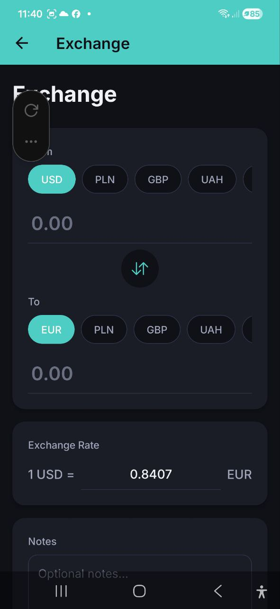

# Portefeuille et change

> Suivez vos soldes dans plusieurs devises et effectuez des changes avec des taux en temps reel. Le portefeuille se met a jour automatiquement lorsque vous ajoutez des depenses et des revenus.

## Apercu

La fonctionnalite Portefeuille vous permet de suivre vos soldes reels dans chaque devise prise en charge. A mesure que vous ajoutez des depenses et des revenus, le portefeuille se met a jour automatiquement pour refleter votre situation financiere actuelle.

## Soldes du Portefeuille

Accedez au Portefeuille depuis :
- **Tableau de bord** — appuyez sur **Tout voir** a cote de la section Soldes du Portefeuille
- **Tableau de bord** — appuyez sur le bouton d'action rapide **Transferts** pour un acces rapide aux transferts
- **Parametres** — allez dans Portefeuille > **Soldes**

Pour chaque devise, vous verrez :

| Champ | Description |
|---|---|
| **Solde actuel** | Votre solde en temps reel dans cette devise |
| **Solde initial** | Le solde de depart que vous avez defini |
| **Total depense** | Somme de toutes les depenses dans cette devise |
| **Total des revenus** | Somme de tous les revenus dans cette devise |
| **Change entrant** | Montant recu lors de changes de devises |
| **Change sortant** | Montant depense lors de changes de devises |
| **Transfert entrant** | Montant recu lors de transferts depuis d'autres comptes |
| **Transfert sortant** | Montant envoye lors de transferts vers d'autres comptes |

La formule : **Solde actuel = Solde initial + Total des revenus - Total depense + Change entrant - Change sortant + Transfert entrant - Transfert sortant**

Une devise apparaît d'elle-même dans le portefeuille dès que vous y enregistrez de l'argent — une dépense, un revenu, un change ou un transfert. Tant que vous ne définissez pas de solde initial, celui-ci vaut 0 : la carte affiche donc exactement la somme de vos transactions. Si vous retirez une devise du portefeuille, elle reste masquée même si vous continuez à y enregistrer des transactions — définissez-lui à nouveau un solde pour faire revenir la carte.

## Definir le solde initial

Definissez votre solde de depart pour chaque devise :

1. Allez dans **Parametres** > **Portefeuille** > **Definir le solde**
2. Selectionnez la **Devise** (USD, EUR, PLN, GBP, UAH, RUB ou BYN)
3. Entrez le **Montant** — votre solde reel actuel dans cette devise
4. Appuyez sur **Enregistrer**

Vous verrez une confirmation : "Solde defini avec succes."

> **Astuce :** Definissez vos soldes initiaux des le debut de votre utilisation de l'application, afin que le portefeuille reflete fidelement vos finances des le premier jour.

## Solde total

Lorsque vous possedez des soldes dans plusieurs devises, l'application calcule un **solde total** converti dans la devise definie dans vos parametres. Le taux de change utilise pour la conversion est le taux en temps reel recupere automatiquement. Cela vous donne une vue d'ensemble de votre patrimoine dans une seule devise de reference.

Vous pouvez changer la devise d'affichage directement ici : appuyez sur une pastille de devise au-dessus du total pour recalculer instantanement le total et le graphique d'Historique du solde dans cette devise. Il s'agit uniquement d'un changement d'affichage pour l'ecran Portefeuille — cela ne modifie pas le parametre de devise global de l'application et revient a votre devise par defaut lorsque vous quittez l'ecran.

## Historique du solde

En haut de l'ecran Portefeuille, la carte **Historique du solde** montre comment votre solde total a evolue chaque mois sous forme de graphique en barres :

- Les **barres vertes** indiquent que votre solde a augmente ce mois-la ; les **barres rouges** indiquent qu'il a diminue.
- Appuyez sur une barre pour voir le changement exact de ce mois.
- Utilisez le bouton **6M / 12M** pour basculer entre les 6 ou 12 derniers mois.
- Les montants suivent la devise que vous selectionnez dans les pastilles de devise, convertis aux taux de change les plus recents.

## Change de devises

Echangez de l'argent entre vos portefeuilles de devises :

### Etape par etape

1. Appuyez sur **Change** dans les actions rapides du Tableau de bord, ou allez dans **Parametres** > **Portefeuille**
2. Selectionnez la devise **De** (par ex. USD) — appuyez sur une pastille de devise pour selectionner
3. Selectionnez la devise **Vers** (par ex. EUR) — appuyez sur une pastille de devise pour selectionner
4. Entrez le montant dans le champ "De" ou "Vers" — l'autre se calcule automatiquement
5. Le **Taux de change** est recupere automatiquement (par ex. "1 USD = 0,8407 EUR")
6. Vous pouvez appuyer sur le bouton **inverser** (fleches au centre) pour inverser les devises
7. Vous pouvez eventuellement modifier le taux de change manuellement si vous avez obtenu un taux different
8. Ajoutez des **Notes** optionnelles (par ex. "Change a l'aeroport" ou "Virement bancaire")
9. Appuyez sur **Change** pour finaliser

### Fonctionnalites

- **Taux de change en temps reel** — recuperes et affiches automatiquement
- **Bouton d'inversion** — inversez rapidement les devises De et Vers
- **Modification manuelle du taux** — modifiez le taux si votre taux reel differe
- **Champ de notes** — ajoutez du contexte au change
- **Changes recents** — consultez votre historique de changes

### Alertes de taux

Vous n'avez pas à surveiller le taux vous-même. Sur l'écran Change, la carte **Alertes de taux** fixe un objectif pour la paire sélectionnée et vous prévient dès que le taux réel l'atteint.

1. Sélectionnez les devises **De** et **Vers** qui vous intéressent
2. Appuyez sur le **+** de la carte **Alertes de taux**
3. Saisissez votre objectif — le champ indique `1 <De> = ___ <Vers>`
4. Choisissez **au-dessus de** ou **en dessous de**. L'application présélectionne ce qui correspond au nombre saisi (au-dessus si votre objectif est supérieur au taux actuel, en dessous s'il est inférieur) ; appuyez sur l'autre puce pour changer
5. Appuyez sur **Ajouter une alerte**

Le taux est vérifié sur nos serveurs une fois par heure : cela fonctionne donc application fermée. Quand votre objectif est atteint, vous recevez une notification — *« 1 EUR vaut maintenant 4,3512 PLN. Appuyez pour échanger. »* — et l'ouvrir affiche l'écran Change avec cette paire déjà sélectionnée.

Chaque alerte se déclenche **une seule fois** puis s'arrête, pour qu'un taux qui oscille autour de votre objectif ne vous prévienne pas en boucle. Créez une nouvelle alerte si vous voulez continuer à suivre la paire.

La carte affiche les alertes de la paire sélectionnée : changer de devises change donc la liste. Appuyez sur l'icône corbeille pour en supprimer une. Vous pouvez conserver jusqu'à **20** alertes actives à la fois.

Les alertes de taux sont **personnelles** : elles vous suivent dans tous vos comptes, personne d'autre ne les voit, et un observateur peut en créer comme tout le monde. Il n'y a pas d'interrupteur distinct dans les réglages de notifications — supprimer l'alerte, c'est l'éteindre.

### Changes recents

Sous le formulaire de change, vous trouverez les 5 changes les plus recents avec :
- Devises echangees (De vers Vers)
- Montants
- Taux de change utilise
- Date
- Notes (si ajoutees)

Appuyez sur **Tout afficher** pour ouvrir l'historique complet des echanges.

### Historique des echanges

L'ecran **Historique des echanges** affiche la liste complete de tous vos changes de devises. Accedez-y en appuyant sur **Tout afficher** dans la section Changes recents.

Filtres disponibles :
- **Devise** — filtrer par une paire de devises specifique
- **Periode** — choisissez parmi : **Tout le temps**, **Ce mois-ci**, **3 derniers mois** ou **Cette annee**

### Modifier ou supprimer un echange

Appuyez sur un echange dans l'historique pour ouvrir son ecran de details. De la, vous pouvez :
- Appuyer sur l'icone **crayon** pour modifier les montants, le taux ou les notes — puis **Enregistrer**
- Appuyer sur l'icone **corbeille** pour supprimer l'echange (une confirmation apparait)

Les soldes du portefeuille sont automatiquement recalcules apres une modification ou une suppression.

## Transferts entre comptes

Transferez de l'argent entre vos differents comptes (par ex. de Entreprise a Personnel) :

### Etape par etape

1. Allez dans **Parametres** > **Portefeuille** > **Transfert**
2. Selectionnez le **Compte source** — le compte d'ou l'argent sera debite. Chaque pastille de compte affiche son solde actuel
3. Selectionnez le **Compte destination** — le compte qui recevra l'argent
4. Selectionnez la **Devise** du transfert
5. Entrez le **Montant** a transferer. Sous le champ, **Disponible :** indique le solde du compte source dans la devise choisie — appuyez sur **Max** pour tout utiliser
6. Si les comptes utilisent des devises differentes, un **Taux de change** sera propose automatiquement — vous pouvez le modifier manuellement
7. Choisissez la **Date** — aujourd'hui par defaut ; appuyez dessus pour enregistrer un transfert passe
8. Ajoutez des **Notes** optionnelles (par ex. "Remboursement frais pro" ou "Epargne mensuelle")
9. Appuyez sur **Transferer** pour finaliser

Si le montant depasse le solde connu de l'application, un avertissement s'affiche, mais le transfert est quand meme enregistre. Il n'est jamais bloque : vous saisissez peut-etre un transfert apres coup, ou le solde initial du compte n'a jamais ete defini.

Un tiret (—) a la place du solde signifie que l'application n'a pas encore ce chiffre. Les soldes des comptes autres que celui en cours viennent du serveur et peuvent donc manquer la premiere fois que vous ouvrez le formulaire hors ligne.

### Transferts frequents

Si vous avez deja effectue des transferts, une ligne **Frequents** apparait en haut du formulaire avec vos trajets les plus utilises (par ex. *Personnel → Epargne 2000 PLN*). Appuyez dessus et le formulaire se remplit : comptes, devises et montant du dernier transfert sur ce trajet. Vous pouvez tout modifier avant d'enregistrer.

Les trajets impliquant un compte auquel vous n'avez plus acces ne sont pas proposes.

### Transferts recents

Sous le formulaire de transfert, vous trouverez les 5 transferts les plus recents avec :
- Compte source et compte destination
- Devise et montant
- Taux de change utilise (si devises differentes)
- Date
- Notes (si ajoutees)

Appuyez sur **Tout afficher** pour ouvrir l'historique complet des transferts.

### Historique des transferts

L'ecran **Historique des transferts** affiche la liste complete de tous vos transferts entre comptes. Accedez-y en appuyant sur **Tout afficher** dans la section Transferts recents.

Filtres disponibles :
- **Compte** — filtrer par un compte source ou destination specifique
- **Periode** — choisissez parmi : **Tout le temps**, **Ce mois-ci**, **3 derniers mois** ou **Cette annee**

### Modifier un transfert

Ouvrez un transfert depuis **Transferts recents** ou l'historique, puis appuyez sur **Modifier**. Vous pouvez changer :
- Les deux comptes — source et destination
- Les montants et le taux de change
- La date
- Les notes et l'option **Compter comme revenu**

Changer un compte bascule aussi ce cote du transfert vers la devise de ce compte. Si **Compter comme revenu** est active, l'ecriture de revenu correspondante est deplacee vers le nouveau compte destination.

Vous pouvez déplacer l'un ou l'autre côté vers n'importe quel autre compte dont vous êtes membre, y compris lorsque cela retire de l'opération le compte dans lequel vous travaillez. C'est ainsi que l'on corrige un transfert arrivé sur le mauvais compte : il apparaît alors dans l'historique des deux comptes auxquels il appartient désormais et disparaît de celui qu'il ne concerne plus.

Enregistrer, modifier et supprimer un transfert fonctionne hors connexion : la modification reste sur votre appareil et part à la prochaine ouverture de l’écran Portefeuille avec une connexion. Si le serveur refuse une modification — par exemple parce que vous n’avez plus accès à l’un des comptes choisis — l’application vous le signale et le transfert reste inchangé.

Dans un compte partagé, tous les membres voient les transferts qui le concernent, quel que soit celui qui les a saisis ; le solde du compte les comptait de toute façon. Tout membre qui aurait pu effectuer le transfert — c’est-à-dire qui appartient aux deux comptes et n’est pas observateur du côté payeur — peut aussi le corriger ou le supprimer.

## Devises prises en charge

| Code | Devise |
|---|---|
| USD | Dollar americain |
| EUR | Euro |
| PLN | Zloty polonais |
| GBP | Livre sterling |
| UAH | Hryvnia ukrainienne |
| RUB | Rouble russe |
| BYN | Rouble bielorusse |

## FAQ

- **Q : D'ou proviennent les taux de change ?**
  **R :** Les taux de change sont recuperes aupres d'un service en ligne et mis a jour regulierement. Ils representent des taux de marche approximatifs.

- **Q : Puis-je effectuer un change si je n'ai pas assez de solde ?**
  **R :** L'application vous avertira d'un solde insuffisant, mais vous pouvez quand meme enregistrer le change pour garder vos comptes a jour.

- **Q : Un change de devises compte-t-il comme une depense ?**
  **R :** Non. Les changes de devises sont separes des depenses — ils deplacent de l'argent entre les portefeuilles de devises sans affecter vos totaux de depenses.

- **Q : Quelle est la difference entre un transfert et un change ?**
  **R :** Un change convertit de l'argent d'une devise a une autre au sein d'un meme compte. Un transfert deplace de l'argent entre deux comptes differents (par ex. de Entreprise a Personnel), sans necessairement changer de devise.

- **Q : Un transfert affecte-t-il le solde du portefeuille ?**
  **R :** Oui. Le compte source voit son solde diminue du montant envoye (Transfert sortant), et le compte destination voit son solde augmente du montant recu (Transfert entrant). Le solde total tous comptes confondus reste inchange si la devise est la meme.

---

*Voir aussi : [Tableau de bord](./02-dashboard.md) | [Parametres](./11-settings.md)*
