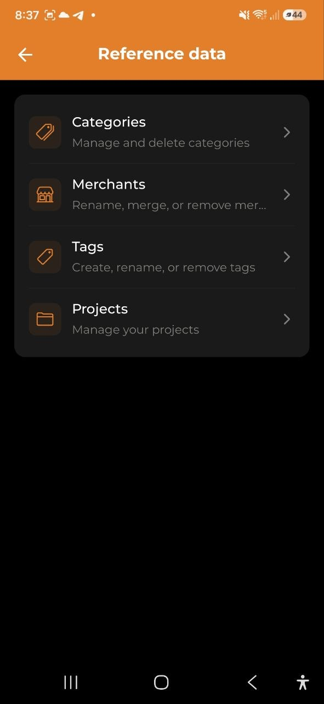

# Données de référence

> Catégories, commerçants, étiquettes et projets sont les briques de l'organisation des dépenses. Gérez-les tous depuis **Paramètres → Données de référence**.

## Aperçu

Les quatre types de données de référence sont gérés depuis un emplacement unique dans les Paramètres. L'interface est cohérente : **appuyez sur une ligne pour modifier**, **+** pour ajouter, **icône poubelle** pour supprimer.

> **Rôle Observateur** : les membres avec ce rôle peuvent consulter les données de référence mais ne peuvent pas ajouter, renommer ni supprimer.

## Catégories

Les catégories classifient les dépenses et revenus. Chacune a un nom et une couleur.

- Appuyez sur une catégorie pour la renommer ou changer sa couleur
- Les noms de catégorie doivent être uniques au sein d'un type : renommer une catégorie avec un nom déjà utilisé est refusé, avec une explication
- Appuyez sur **+** pour créer une nouvelle catégorie (Dépenses ou Revenus)
- Appuyez sur la poubelle pour supprimer (bloqué si la catégorie est utilisée)
- Les catégories système ne peuvent pas être supprimées
- Si une catégorie que vous avez attribuée n'apparaît pas sur vos autres appareils, ouvrez l'application une fois en ligne : les attributions sont renvoyées automatiquement
- Une catégorie encore utilisée par des dépenses, des budgets ou des sous-catégories ne peut pas être supprimée : supprimez-les ou réaffectez-les d'abord

## Commerçants

Les commerçants sont créés automatiquement lors de l'ajout de dépenses. Utilisez l'écran Commerçants pour nettoyer les doublons.

- Appuyez sur un commerçant pour le renommer
- Renommer fusionne toutes les dépenses sous le nouveau nom
- Supprimer retire le nom du commerçant de toutes les dépenses correspondantes

> Les commerçants ne peuvent pas être créés manuellement.

### Règles de catégorie

L'app apprend de vos corrections. Chaque fois que vous modifiez la catégorie d'une dépense ayant un nom de commerçant, une **règle de catégorie** est enregistrée automatiquement. La prochaine fois que ce commerçant apparaît — dans un relevé bancaire ou CSV Wise importé, sur un reçu scanné, ou via une notification bancaire capturée automatiquement (Android) —, l'app applique votre règle et attribue la catégorie sans correction manuelle.

- Les règles apprises apparaissent dans la section **Règles de catégorie** en bas de l'écran Commerçants
- Appuyez sur la corbeille pour supprimer une règle
- Appuyez sur l'icône d'actualisation à côté d'une règle pour la **réappliquer** — cela retrouve les dépenses de ce commerçant déjà classées dans une autre catégorie et propose de les déplacer aussi vers la catégorie de la règle, afin que les anciennes dépenses rattrapent les règles apprises plus tard
- Les règles sont stockées sur le serveur et synchronisées sur tous vos appareils

## Étiquettes

Les étiquettes permettent de marquer les dépenses avec des mots-clés libres.

- Appuyez sur **+** pour créer une étiquette (nom et couleur)
- Appuyez sur une étiquette pour modifier le nom ou la couleur
- Appuyez sur la poubelle pour supprimer l'étiquette

## Projets

Les projets regroupent les dépenses par objectif ou activité.

- Appuyez sur **+** pour créer un projet (nom, description, couleur, budget optionnel)
- Appuyez sur un projet pour ouvrir l'écran de détails
  - Voir toutes les dépenses liées, le total et le budget restant
  - Utilisez l'**icône crayon** (en haut à droite) pour modifier
  - Utilisez l'**icône poubelle** (en haut à droite) pour supprimer

---

*Voir aussi : [Dépenses et revenus](./03-expenses-and-income.md) | [Analyses](./06-analytics.md) | [Paramètres](./11-settings.md)*
