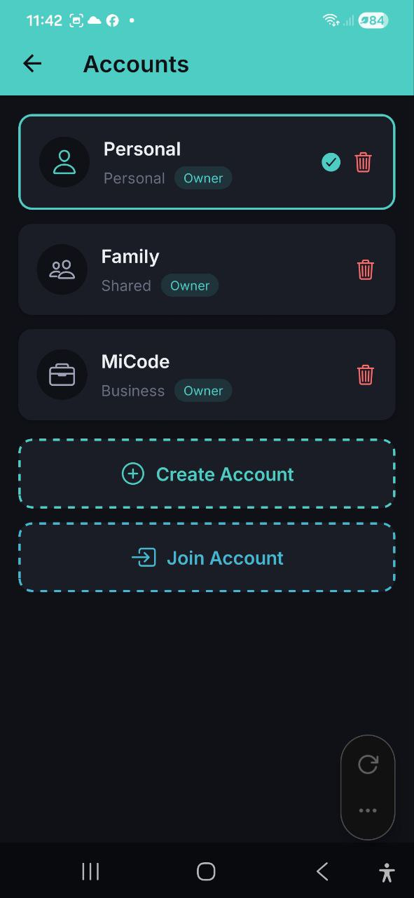
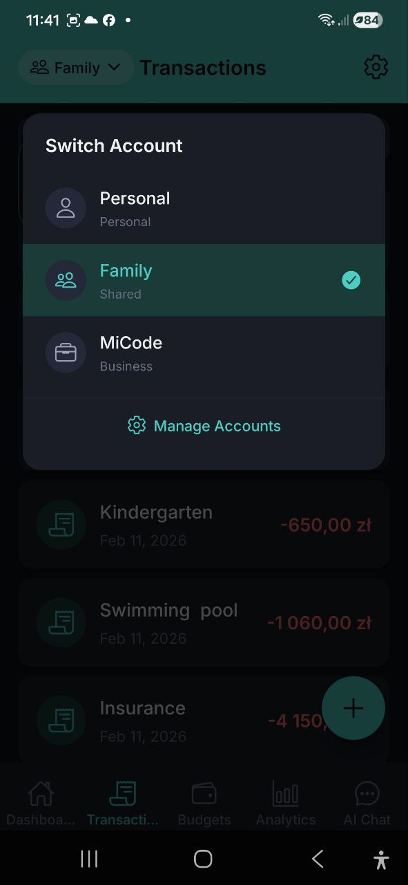
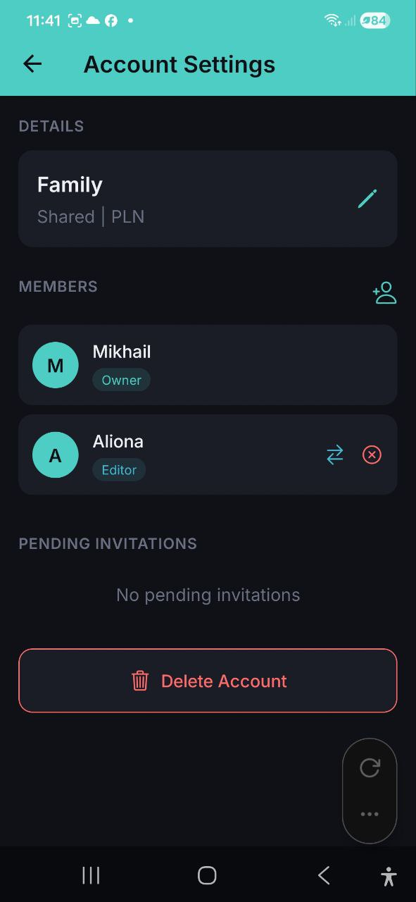

# Accounts

> Organiseer je financiën met aparte accounts. Gebruik Persoonlijk voor individueel bijhouden, Gedeeld voor gezinsbudgetten en Zakelijk voor bedrijfsuitgaven. Nodig leden uit met rolgebaseerde toegangscontrole.

## Overzicht

De app ondersteunt meerdere accounts om verschillende financiële contexten te scheiden. Elk account heeft zijn eigen uitgaven, inkomsten, budgetten en portemonnee.

## Accounttypen

| Type | Pictogram | Doel |
|---|---|---|
| **Persoonlijk** | Persoonpictogram | Individueel uitgaven bijhouden |
| **Gedeeld** | Mensenpictogram | Gezins- of groepsbudgetten (bijv. "Familie") |
| **Zakelijk** | Aktetaspictogram | Bedrijfs- of teamuitgaven (bijv. "MiCode") |
| **Beleggingen** | Stijgende-trendpictogram | Beleggingsportefeuilles en -activa bijhouden |
| **Reis** | Vliegtuigpictogram | Tijdelijk gedeeld account voor een groepsreis — verdeel uitgaven tussen de leden en reken af wie wie iets verschuldigd is ([Reisportemonnee](./35-group-trip-wallet.md)) |

Elk account toont zijn type en jouw rol (Eigenaar, Bewerker of Kijker).

## Wisselen van account

1. Tik op de **accountnaam** linksboven in een willekeurig scherm (bijv. "Familie")
2. Het uitklapmenu **Account wisselen** opent met al je accounts
3. Tik op het account waarnaar je wilt wisselen
4. Het actieve account is gemarkeerd met een groen vinkje
5. Alle schermen worden bijgewerkt naar de gegevens van het geselecteerde account

Tik op **Accounts beheren** onderaan het uitklapmenu om naar de volledige accountlijst te gaan.

## De weergavevaluta wijzigen

Wijzig de valuta waarin al je totalen worden getoond — vanuit elk scherm, zonder Instellingen te openen.

Op het startscherm gaat het het snelst via de speciale **valutaknop** naast de accountnaam — tik erop en kies een valuta. Op andere schermen:

1. Tik op de **accountnaam** linksboven in een willekeurig scherm. Het huidige valutasymbool verschijnt naast de naam (bijv. `Persoonlijk · $`).
2. Zoek in het menu dat opent de sectie **Weergavevaluta** onder je accountlijst.
3. Tik op de gewenste valuta (USD, EUR, PLN, GBP, UAH, RUB, BYN).
4. Elk bedrag in de app wordt direct omgerekend naar de geselecteerde valuta tegen de meest recente wisselkoersen.

> Dit is jouw persoonlijke weergavevaluta en wordt voor de volgende keer opgeslagen. Het verandert alleen hoe bedragen worden *getoond* — je transacties behouden hun oorspronkelijke valuta's. Elk lid (ook Kijkers) kan zijn eigen weergavevaluta kiezen.

## Een account aanmaken

1. Ga naar de accountlijst (via **Accounts beheren** of vanuit Instellingen)
2. Tik op **Account aanmaken**
3. Voer een **Accountnaam** in (bijv. "Mijn budget")
4. Selecteer het **Accounttype**: Persoonlijk, Gedeeld, Zakelijk, Beleggingen of Reis
5. Selecteer de **Valuta** voor dit account
6. Tik op **Aanmaken**

> **Let op:** Het gratis abonnement staat 3 accounts toe, Pro tot 5, Business onbeperkt accounts.

## Lid worden van een account

Als iemand je via zoeken heeft gevonden en direct heeft uitgenodigd, heb je geen code nodig:

1. Je krijgt een pushmelding zodra de uitnodiging binnenkomt
2. Tik erop (of open **Meldingen** en schakel over naar het tabblad **Uitnodigingen**)
3. Tik op **Accepteren** om lid te worden, of op **Weigeren** om het af te wijzen
4. Geaccepteerde uitnodigingen voegen het account meteen toe aan je lijst

Als je in plaats daarvan een uitnodigingscode of -link hebt ontvangen:

1. Tik op **Lid worden van account** in de accountlijst
2. Voer de **uitnodigingscode** in die je hebt ontvangen
3. Tik op **Deelnemen**
4. Je ziet een succesbericht: "Je bent succesvol lid geworden van het account!"
5. Het account verschijnt nu in je accountlijst

## Accountinstellingen

Tik op een account om de instellingen ervan te openen:

### Details
- Account**naam** (bewerkbaar door de Eigenaar)
- Account**type** en **valuta** (alleen weergave)
- **Financiële maand** (alleen Eigenaar) — verandert wat "deze maand" betekent voor je budgetten

### Financiële maand

Standaard lopen budgetten op de kalendermaand (1e t/m de laatste dag). Als je salaris op een andere dag van de maand binnenkomt — bijvoorbeeld de 10e — kun je budgetten daar in plaats daarvan op laten aansluiten:

1. Open Accountinstellingen en tik op de rij **Financiële maand** (toont "Kalendermaand" of "Maand begint op dag N")
2. Kies in het geopende venster **Kalendermaand** om te resetten, of een dag van **1 tot en met 31**
3. Tik op **Opslaan**

> **Let op:** Dit heeft voorlopig alleen invloed op **budgetten** — hoe hun periodes worden berekend en welke uitgaven daarin meetellen. Analyses, rapporten en andere weergaven op maandbasis gebruiken nog steeds de kalendermaand.
>
> De wijziging werkt met terugwerkende kracht: eerdere budgetperiodes en de geschiedenis worden dienovereenkomstig herberekend, zonder dat er uitgave- of inkomstengegevens veranderen.
>
> Als je een dag kiest die niet in elke maand bestaat (bijvoorbeeld 31), begint de periode in kortere maanden gewoon op de laatste dag (bijvoorbeeld de 28e of 29e in februari).

Alleen de Eigenaar ziet deze rij — Bewerkers en Kijkers zien hem helemaal niet in de Accountinstellingen. Eenmaal ingesteld, bepaalt de financiële maand nog steeds de budgetperiodes en -geschiedenis die alle leden zien.

### Leden
- Lijst van alle accountleden met hun rollen
- Elk lid toont: avatar, naam en rolbadge (Eigenaar, Bewerker, Kijker)

### Leden uitnodigen

1. Open de Accountinstellingen voor het account
2. Tik op het **uitnodigingspictogram** (persoon+-pictogram rechtsboven in de sectie Leden)
3. Kies een uitnodigingsmethode:
   - **Gebruiker zoeken** — als de persoon de app al heeft, zoek hem op naam of e-mail, selecteer hem uit de resultaten, kies zijn rol en tik op **Uitnodiging verzenden**. Hij krijgt meteen een pushmelding — geen code nodig.
   - **Per e-mail** — voer het e-mailadres van de persoon in, selecteer zijn rol (Bewerker of Kijker), tik op **Uitnodiging verzenden**
   - **Per link** — er wordt een code gegenereerd die je kunt delen. Tik om te kopiëren of te delen via berichten-apps

### Leden beheren (alleen Eigenaar)

- **Rol wijzigen** — tik op het rolwijzigingspictogram naast een lid om een nieuwe rol toe te wijzen
- **Lid verwijderen** — tik op het verwijderpictogram om een lid te verwijderen (met bevestiging)

### Openstaande uitnodigingen

- Bekijk uitnodigingen die nog niet zijn geaccepteerd
- **Uitnodiging annuleren** — een openstaande uitnodiging intrekken

## Rollen en machtigingen

| Machtiging | Eigenaar | Bewerker | Kijker |
|---|---|---|---|
| Uitgaven & inkomsten bekijken | Ja | Ja | Ja |
| Uitgaven toevoegen/bewerken | Ja | Ja | Nee |
| Inkomsten toevoegen/bewerken | Ja | Ja | Nee |
| Budgetten maken/bewerken | Ja | Ja | Nee |
| Leden beheren | Ja | Nee | Nee |
| Accountinstellingen bewerken | Ja | Nee | Nee |
| Account verwijderen | Ja | Nee | Nee |

### Rolbeschrijvingen
- **Eigenaar** — volledige controle over het account, kan leden en instellingen beheren
- **Bewerker** — kan uitgaven, inkomsten en budgetten toevoegen en bewerken
- **Kijker** — kan alleen gegevens bekijken (alleen-lezentoegang)

## Een account verwijderen

1. Open de Accountinstellingen
2. Scrol naar onderen en tik op **Account verwijderen**
3. Bevestig de verwijdering

> **Waarschuwing:** Bij het verwijderen van een account worden alle bijbehorende gegevens (uitgaven, inkomsten, budgetten) permanent verwijderd. Deze actie kan niet ongedaan worden gemaakt.

## Een account verlaten

Als je lid (niet de Eigenaar) bent van een gedeeld account:
1. Open de Accountinstellingen
2. Tik op **Account verlaten**
3. Bevestig — je wordt uit het account verwijderd

## Account wisselen in Telegram

Wanneer je de Telegram-bot gebruikt, kun je op twee manieren van account wisselen:

1. **Handmatig** — stuur `/account` en tik op de accountknop
2. **Automatisch** — vermeld een accountnaam in je bericht (bijv. "Toon uitgaven in Familie") en de AI bevraagt dat account voor het huidige verzoek

De automatische detectie verandert je standaardaccount niet — het geldt alleen voor het huidige bericht. Gebruik `/account` om permanent te wisselen.

## Veelgestelde vragen

- **V: Hoeveel accounts kan ik hebben?**
  **A:** Free: 3 accounts, Pro: tot 5, Business: onbeperkt.

- **V: Kan ik het eigenaarschap van een account overdragen?**
  **A:** Op dit moment is de aanmaker van het account altijd de Eigenaar. Neem contact op met de ondersteuning voor het overdragen van eigenaarschap.

- **V: Kan ik zien wie een uitgave heeft toegevoegd in een gedeeld account?**
  **A:** Uitgaven in gedeelde accounts tonen welk lid ze heeft aangemaakt.

- **V: Kan ik verschillende accounts gebruiken in de Telegram-bot?**
  **A:** Ja. Stuur `/account` om je standaardaccount te wisselen, of vermeld simpelweg de accountnaam in je bericht voor eenmalige zoekopdrachten. Zie [Telegram-bot](./22-telegram-bot.md) voor details.

---

*Zie ook: [Instellingen](./11-settings.md) | [Abonnementen](./12-subscription.md)*
