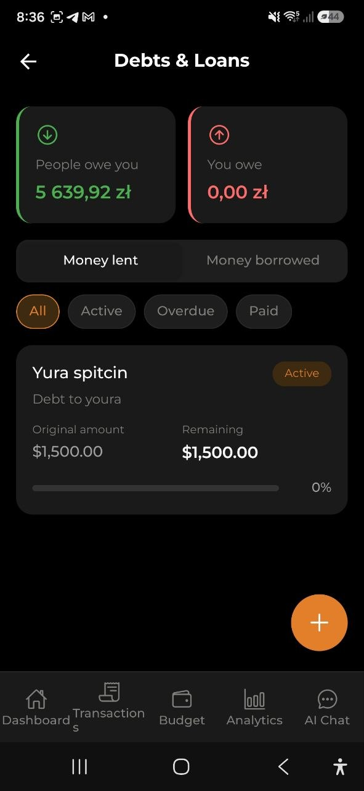

# Schulden & Leningen

> Houd geld bij dat je uitleent en leent. Zie wie jou geld verschuldigd is, wie jij geld verschuldigd bent, leg terugbetalingen vast en bewaak vervaldatums — allemaal geïntegreerd met je uitgaven en inkomsten.

## Overzicht

Met de functie Schulden & Leningen kun je twee soorten financiële verplichtingen bijhouden:

- **Uitgeleend geld** — geld dat je aan iemand hebt gegeven (vastgelegd als een uitgave met schuldmarkering)
- **Geleend geld** — geld dat iemand aan jou heeft gegeven (vastgelegd als een inkomst met schuldmarkering)

Terugbetalingen werken op dezelfde manier:
- Wanneer iemand **jou terugbetaalt**, wordt dit vastgelegd als inkomst gekoppeld aan de oorspronkelijke schulduitgave
- Wanneer **jij iemand terugbetaalt**, wordt dit vastgelegd als uitgave gekoppeld aan de oorspronkelijke schuldinkomst

De schuldstatus wordt automatisch berekend:
- **Actief** — er is nog een openstaand saldo
- **Betaald** — de schuld is volledig terugbetaald
- **Achterstallig** — de vervaldatum is verstreken en het saldo is nog steeds openstaand

## Een schuld aanmaken

De snelste manier om een schuld toe te voegen is via het scherm **Schulden & Leningen**:

1. Open het scherm **Schulden & Leningen** (via de Dashboardwidget of Instellingen)
2. Tik op de knop **+** in de rechterbenedenhoek
3. Kies **Geld uitlenen** of **Geld lenen**
4. Vul het bedrag, de beschrijving, de contactnaam en een optionele vervaldatum in
5. Tik op **Opslaan**

Je kunt schulden ook handmatig aanmaken vanuit de uitgaven- of inkomstenformulieren (zie hieronder).

## Geld uitlenen

### Stap voor stap

1. Ga naar **Transacties** en tik op de knop **+**
2. Selecteer **Handmatige invoer**
3. Voer het **bedrag** in dat je uitleent
4. Voer een **beschrijving** in (bijv. "Lening aan Jan")
5. Schakel de schakelaar **Ik heb geld uitgeleend** in
6. Voer de **contactnaam** in — aan wie je uitleent
7. Stel optioneel een **vervaldatum** in — wanneer je verwacht terugbetaald te worden
8. Tik op **Uitgave opslaan**

De uitgave wordt gemarkeerd als een schuld en verschijnt op het scherm Schulden & Leningen.

> **Opmerking:** Het bedrag beïnvloedt je portemonnee-saldo als een gewone uitgave (geld eruit).

## Geld lenen

### Stap voor stap

1. Ga naar **Transacties**, schakel over naar het tabblad **Inkomsten** en tik op **+**
2. Voer het **bedrag** in dat je leent
3. Voer een **beschrijving** in (bijv. "Lening van Maria")
4. Schakel de schakelaar **Ik heb geld geleend** in
5. Voer de **contactnaam** in — van wie je leent
6. Stel optioneel een **vervaldatum** in — wanneer je moet terugbetalen
7. Tik op **Inkomst opslaan**

De inkomst wordt gemarkeerd als een schuld en verschijnt op het scherm Schulden & Leningen.

> **Opmerking:** Het bedrag beïnvloedt je portemonnee-saldo als gewone inkomst (geld erin).

## Een terugbetaling vastleggen

### Wanneer iemand jou terugbetaalt (voor uitgeleend geld)

1. Open de oorspronkelijke **uitgave** (de lening die je hebt gegeven)
2. Tik op **Terugbetaling vastleggen**
3. Je wordt doorgestuurd naar een nieuw inkomstenformulier met vooraf ingevulde contactnaam en valuta
4. Voer het **terugbetalingsbedrag** in (kan gedeeltelijk zijn)
5. Tik op **Inkomst opslaan**

### Wanneer jij iemand terugbetaalt (voor geleend geld)

1. Open de oorspronkelijke **inkomst** (de lening die je hebt ontvangen)
2. Tik op **Terugbetaling vastleggen**
3. Je wordt doorgestuurd naar een nieuw uitgavenformulier met vooraf ingevulde contactnaam en valuta
4. Voer het **terugbetalingsbedrag** in (kan gedeeltelijk zijn)
5. Tik op **Uitgave opslaan**

> **Tip:** Je kunt meerdere gedeeltelijke terugbetalingen vastleggen. Het resterende saldo wordt automatisch bijgewerkt.

## Scherm Schulden & Leningen

Open het scherm Schulden & Leningen via **Instellingen > Schulden & Leningen**, of door op de schuldwidget op het Dashboard te tikken.

### Overzichtskaarten

Bovenaan het scherm tonen twee overzichtskaarten:
- **Mensen zijn jou verschuldigd** — totaal resterend bedrag dat anderen jou verschuldigd zijn (groen)
- **Jij bent verschuldigd** — totaal resterend bedrag dat jij anderen verschuldigd bent (rood)

Bedragen worden automatisch omgerekend naar je basisvaluta met de huidige wisselkoersen.

### Tabbladen

Schakel tussen twee weergaven:
- **Uitgeleend geld** — schulden waarbij je geld aan anderen hebt uitgeleend
- **Geleend geld** — schulden waarbij je geld van anderen hebt geleend

### Filterchips

Filter schulden op status:
- **Alle** — toon alle schulden
- **Actief** — alleen schulden met openstaand saldo
- **Achterstallig** — alleen schulden die hun vervaldatum hebben overschreden
- **Betaald** — alleen volledig terugbetaalde schulden

### Schuldkaart

Elke schuld toont:
- **Contactnaam** — met wie de schuld is
- **Beschrijving** — waar de schuld voor was
- **Statusbadge** — Actief (blauw), Achterstallig (rood) of Betaald (groen)
- **Oorspronkelijk bedrag** — het initiële schuldbedrag in de oorspronkelijke valuta
- **Resterend bedrag** — hoeveel er nog verschuldigd is
- **Voortgangsbalk** — visuele indicator van de terugbetalingsvoortgang (percentage)
- **Vervaldatum** — wanneer de schuld vervalt (indien ingesteld)

Tik op een schuldkaart om de volledige uitgaven- of inkomstendetails te bekijken, waar je terugbetalingen kunt vastleggen.

## Pushherinneringen

Wanneer een schuld een vervaldatum heeft, stuurt de app automatisch pushmeldingen om je op koers te houden:

- **3 dagen voor de vervaldatum** — een aankomende herinnering: "Schuld vervalt over 3 dagen: Jan"
- **De dag na de vervaldatum** — een achterstalligheidswaarschuwing: "Schuld achterstallig: Jan"

Meldingen worden gestuurd naar de persoon die de schuld heeft vastgelegd (de schuldeigenaar), niet naar de tegenpartij.

Om deze herinneringen in of uit te schakelen, ga je naar **Instellingen → Meldingen & Integraties → Schuldherinneringen**.

## Dashboardwidget

De widget Schulden & Leningen is altijd zichtbaar op het Dashboard (wanneer ingeschakeld in de widgetinstellingen):

- **Wanneer je schulden hebt:** toont de totalen "Mensen zijn jou verschuldigd" en "Jij bent verschuldigd", plus een knop **+** om snel naar het scherm Schulden & Leningen te navigeren
- **Wanneer je geen schulden hebt:** toont een lege staat met een knop **Schuld toevoegen** om te beginnen

Tik op de widget om direct naar het scherm Schulden & Leningen te gaan.

## Ondersteuning voor meerdere valuta's

Schulden kunnen in elke ondersteunde valuta zijn. De overzichtstotalen op het Dashboard en het scherm Schulden worden automatisch omgerekend naar je basisvaluta met live wisselkoersen. Individuele schuldkaarten tonen bedragen altijd in de oorspronkelijke valuta.

## Veelgestelde vragen

- **V: Kan ik geld in de ene valuta uitlenen en terugbetaling in een andere ontvangen?**
  **A:** Terugbetalingen worden vastgelegd in dezelfde valuta als de oorspronkelijke schuld om nauwkeurige registratie te garanderen.

- **V: Beïnvloedt het uitlenen van geld mijn budget?**
  **A:** Ja, uitlenen wordt vastgelegd als een uitgave en lenen als inkomst. Ze beïnvloeden je portemonnee-saldo en budgetregistratie net als elke andere transactie.

- **V: Kan ik een schuld bewerken nadat ik deze heb aangemaakt?**
  **A:** Ja, tik op de schuld om de details te bekijken en gebruik vervolgens de knop Bewerken. Je kunt de beschrijving, contactnaam en vervaldatum wijzigen.

- **V: Wat gebeurt er wanneer een schuld volledig is terugbetaald?**
  **A:** De status verandert automatisch in "Betaald" en de voortgangsbalk toont 100%. De schuld blijft in je geschiedenis ter referentie.

- **V: Hoe verwijder ik een schuld?**
  **A:** Open de schulddetails en tik op Verwijderen. Houd er rekening mee dat hiermee ook de onderliggende uitgaven- of inkomstenpost wordt verwijderd.

---

*Zie ook: [Uitgaven & Inkomsten](./03-expenses-and-income.md) | [Portemonnee & Valutawissel](./10-wallet-and-exchange.md)*
