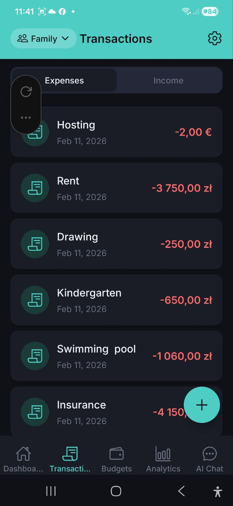
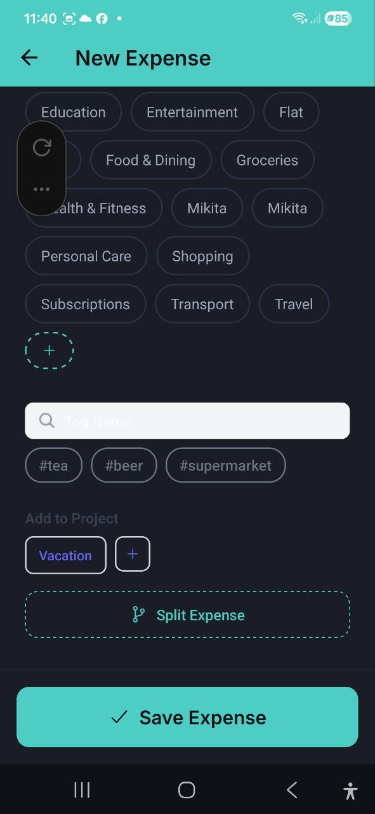

# Wydatki i przychody

> Przegladaj, dodawaj i zarzadzaj wszystkimi transakcjami. Przelaczaj miedzy zakladkami Wydatki i Przychody, z obsluga wielu walut, kategorii, tagow, projektow i podzialu wydatkow.

## Lista transakcji

Ekran **Transakcje** posiada dwie zakladki u gory:
- **Wydatki** — wszystkie Twoje wydatki, posortowane wedlug daty (najnowsze najpierw)
- **Przychody** — wszystkie wpisy przychodow

Kazda transakcja wyswietla:
- Ikone kategorii
- Opis (np. "Hosting", "Czynsz", "Przedszkole")
- Date
- Kwote z waluta, kodowana kolorami: czerwony dla wydatkow (np. **-3 750,00 zl**), zielony dla przychodow

Dotknij dowolna transakcje, aby zobaczyc jej pelne szczegoly.

### Szybkie akcje (dluge nacisniecie)

Przytrzymaj dowolna transakcje na liscie, aby otworzyc menu szybkich akcji:
- **Edytuj** — otworz transakcje w trybie edycji
- **Duplikuj** — utworz nowa transakcje z tymi samymi danymi
- **Usun** — usun transakcje (z potwierdzeniem)

> **Uwaga:** Duplikowanie i usuwanie sa dostepne tylko dla wlascicieli i edytorow konta.

### Akcje zbiorcze

W przypadku wydatkow menu zawiera dodatkowo **Zaznacz wiele**. Dotknij, aby wlaczyc tryb wielokrotnego wyboru:
- Dotykaj wierszy, aby zaznaczyc te, ktore chcesz, lub uzyj **Zaznacz wszystko**, aby zaznaczyc wszystkie
- Dolny pasek pozwala wykonac akcje na wszystkich zaznaczonych wydatkach naraz: **Ustaw kategorie**, **Dodaj tag** lub **Usun**
- Dotknij **Anuluj**, aby wyjsc z trybu wielokrotnego wyboru bez zmian

Uzyj plywajacego przycisku **+** (prawy dolny rog), aby dodac nowa transakcje.

## Dodawanie nowego wydatku (recznie)

### Krok po kroku

1. Dotknij przycisku **+** na ekranie Transakcje lub **Dodaj wydatek** z Pulpitu
2. Jezeli uzywasz przycisku **+**, wybierz **Reczne wprowadzanie** z menu
3. Dotknij symbolu waluty, aby zmienic walute (USD, EUR, PLN, GBP, UAH, RUB, BYN)
4. Wprowadz **kwote**
5. Wprowadz **Opis** (np. "Na co byl ten wydatek?")
6. Dotknij **Daty** — jest wypełniona dzisiejszą datą; dotknij jej, aby zapisać wydatek z wcześniejszego dnia
7. Wybierz **Kategorie** z dostepnych elementow:
   - Jedzenie i restauracje, Artykuly spozywcze, Transport, Zakupy, Rozrywka, Zdrowie i fitness, Rachunki i media, Edukacja, Podroze, Kawa i napoje, Subskrypcje, Odziez, Higiena osobista
   - Dotknij przycisk **+**, aby utworzyc wlasna kategorie
8. Wyszukaj i wybierz **Tagi** (np. #herbata, #piwo, #supermarket) — opcjonalnie
9. Wybierz **Dodaj do projektu** (np. "Wakacje") — opcjonalnie
10. Dotknij **Podziel wydatek**, aby rozdzielic wydatek miedzy wiele kategorii — opcjonalnie
11. Dotknij **Zapisz wydatek**

### Kategorie

Aplikacja udostepnia 13 wbudowanych kategorii wydatkow. Mozesz rowniez tworzyc wlasne kategorie, dotykajac przycisk **+** w selektorze kategorii. Kazda kategoria ma unikatowy kolor do latwej identyfikacji na wykresach i listach.

Dotknij filtra kategorii nad listą transakcji, aby filtrować według kategorii. Działa na obu kartach — Wydatki i Przychody:

- Wybierz kategorię, aby zobaczyć tylko te transakcje
- Wybierz **Bez kategorii**, aby zobaczyć wszystko, co wciąż czeka na uporządkowanie
- Wybierz **Wszystkie**, aby wyczyścić filtr

Filtr kategorii łączy się z okresem wybranym powyżej, więc aby znaleźć starsze pozycje bez kategorii, najpierw ustaw okres na **Wszystko**.

### Sugerowanie kategorii dla wydatków bez kategorii

Gdy na koncie są wydatki bez kategorii — często po zeskanowaniu kilku paragonów — nad listą transakcji pojawia się baner: **Wydatki bez kategorii: N**, z przyciskiem **Zaproponuj kategorie**.

Dotknij go, aby otworzyć **Kategoryzuj wydatki**. Aplikacja analizuje wydatki bez kategorii (zobaczysz **Analizuję wydatki…**) i grupuje je:

- ✚ **Nowa kategoria** — zostanie utworzona tylko po zastosowaniu zmian
- ● **Istniejąca kategoria** — taka, którą już masz
- **Nie udało się ustalić** — wszystko, co do czego asystent nie był pewny; wybierz kategorię ręcznie albo zostaw bez zmian

Dla każdej grupy możesz:
- Dotknąć nazwy grupy, aby zmienić nazwę nowej kategorii przed jej utworzeniem
- Dotknąć **▾** obok grupy, aby przekierować całą grupę — do innej istniejącej kategorii, pod inną nazwą nowej kategorii, albo wybrać **+ Utwórz nową kategorię**
- Dotknąć **Wybierz** (albo **▾**) obok pojedynczego wydatku, aby przenieść tylko ten jeden
- Odznaczyć grupę, aby zostawić te wydatki bez zmian

Nic nie zostaje utworzone ani zmienione, dopóki nie dotkniesz **Zastosuj (N)** — pokazywanego jako **Zastosuj (N) · nowe kategorie: K**, gdy plan obejmuje nowe kategorie. Potem zobaczysz **Skategoryzowano: N · nowe kategorie: K**.

Kilka rzeczy wartych wiedzy:
- Podpowiedzi oparte na AI są ograniczone do kilku przebiegów na konto dziennie. Gdy limit się wyczerpie, pojawi się informacja, że do końca dnia pokazywane są tylko podpowiedzi z reguł — podpowiedzi pochodzące od sprzedawcy, którego już nauczyłeś aplikację (przypisując mu wcześniej kategorię ręcznie), działają zawsze, bez dziennego limitu.
- Zaszyfrowanych wydatków serwer nie może odczytać na potrzeby tej funkcji, więc są pomijane; zobaczysz, ile ich było, jeśli w ogóle.
- Jeśli nie ma już nic do zaproponowania, zobaczysz **Na razie nie ma czego proponować.**
- Jeśli wczytywanie się nie powiedzie, dotknij **Spróbuj ponownie**.
- Osoby z rolą **Obserwatora** na wspólnym koncie nie widzą tego banera — kategoryzowanie to zmiana, którą mogą wykonać tylko Edytorzy i Właściciel.

Na ekranie transakcji na komputerze (web) ten sam przegląd otwiera się jako okno dialogowe.

Ten sam przegląd jest dostępny też na karcie Przychody — dotknij tam **Zaproponuj kategorie** dla przychodów bez kategorii.

### Tagi

Tagi pomagaja organizowac wydatki za pomoca niestandardowych etykiet:
- Wyszukuj istniejace tagi za pomoca pola wyszukiwania
- Wybieraj z ostatnich lub popularnych tagow
- AI moze sugerowac odpowiednie tagi na podstawie opisu
- Tagi wyswietlaja sie jako elementy (np. **#herbata**, **#piwo**, **#supermarket**)

### Projekty

Lacz wydatki z projektami w celu grupowego sledzenia:
- Wybierz istniejacy projekt (np. **Wakacje**)
- Dotknij **+**, aby utworzyc nowy projekt
- Przegladaj sumy wydatkow projektu w sekcji Projekty
- Zmien lub usun projekt pozniej — otworz wydatek, dotknij **Edytuj**, a nastepnie wybierz inny projekt lub dotknij **Wyczysc**

### Sprzedawca

Śledź, gdzie wydałeś pieniądze — sprzedawca (sklep lub firma):
- Wypełniany automatycznie podczas skanowania paragonu lub importu transakcji bankowych/Wise
- Dodaj lub edytuj go ręcznie przy dowolnym wydatku; zacznij pisać, aby wybrać z wcześniej używanych sprzedawców
- Pokazywany przy wydatku i na liście; dotknij filtra sprzedawcy na karcie Wydatki, aby zobaczyć wszystkie wydatki u jednego sprzedawcy
- Filtr sprzedawców pozwala wybrać **kilku sprzedawców naraz** (dotknij ponownie, aby usunąć jednego), a karta Wydatki pokazuje **sumę aktualnie przefiltrowanych** pozycji, przeliczoną na Twoją walutę główną
- Zarządzaj sprzedawcami w **Ustawienia → Sprzedawcy**: zmień nazwę, scal duplikaty lub usuń sprzedawcę
- Podczas skanowania paragonu lub dodawania głosem sprzedawca jest dopasowywany do istniejących, aby uniknąć duplikatów

### Podziel wydatek

Rozdziel pojedynczy wydatek miedzy wiele kategorii:
1. Dotknij **Podziel wydatek** w formularzu wydatku
2. Dodaj kategorie z kwotami lub procentami
3. Suma musi byc rowna kwocie oryginalnego wydatku
4. Dotknij **Potwierdz podzial**

> **Wskazowka:** Uzyj **Zasugeruj podzial**, aby AI zaproponowal, jak rozdzielic wydatek.

## Dodawanie przychodu

### Krok po kroku

1. Przejdz do zakladki **Transakcje** i przelacz na zakladke **Przychody**
2. Dotknij przycisku **+**
3. Dotknij symbolu waluty, aby wybrac walute
4. Wprowadz **kwote**
5. Wprowadz **Opis** (np. "Skad pochodzi ten przychod?")
6. Dotknij **Daty** — jest wypełniona dzisiejszą datą; dotknij jej, aby zapisać przychód z wcześniejszego dnia
7. Wybierz **Kategorie**: Wynagrodzenie, Freelance, Inwestycje, Prezenty lub Inne przychody
8. Dodaj opcjonalne **Notatki**
9. Dotknij **Zapisz przychod**

## Szczegoly wydatku

Dotknij dowolny wydatek, aby zobaczyc jego pelne szczegoly:

- **Opis** i kwota z waluta
- **Data** wydatku
- **Kategoria** ze wskaznikiem koloru
- **Notatki** (jezeli dodano)
- **Dodane przez** — w udostępnionych kontach; wyświetla nazwę członka konta, który utworzył ten wpis
- **Status synchronizacji** — oczekujacy, zsynchronizowany, konflikt lub blad
- **Źródło** — Ręczne wprowadzanie, Głosowo, Skan paragonu, Zaimportowano lub Autozapis (transakcje z powiadomienia bankowego lub importu są oznaczone, by było widać, skąd pochodzą)
- **Pozycje paragonu** — poszczególne pozycje (dla zeskanowanych paragonów lub wyodrębnione później przez **Wyodrębnij pozycje**)
- **Zdjęcie paragonu** — przeglądanie, udostępnianie, zapisywanie do galerii, podmiana lub usunięcie zdjęcia paragonu. Paragony PDF są pokazywane jako dokument z możliwością otwarcia. Jeśli paragon nie jest jeszcze dołączony, kliknij **Dołącz paragon**, by go dodać — wybierz **Zrób zdjęcie**, **Z galerii** lub **Wybierz PDF**. Działa dla każdego wydatku, w tym dodanego ręcznie. Jeśli paragon został dołączony po utworzeniu wydatku, kliknij **Wyodrębnij pozycje** w karcie paragonu, aby ponownie odczytać go AI i pobrać pozycje do wydatku (z potwierdzeniem, gdy pozycje już istnieją; każde uruchomienie zużywa jedno zapytanie AI)

### Dostepne akcje w szczegolach wydatku:
- **Edytuj** — zmodyfikuj wydatek, w tym jego **walutę** (dotknij plakietki waluty obok kwoty; sama kwota nie jest przeliczana, zmienia się tylko jej oznaczenie)
- **Kopiuj** — utworz duplikat
- **Usun** — usun wydatek (z potwierdzeniem)

## Szczegoly przychodu

Dotknij dowolny wpis przychodu, aby zobaczyc szczegoly:
- Opis, data, kategoria, notatki
- **Dodane przez** — w udostępnionych kontach pokazuje, kto utworzył ten wpis przychodu
- **Edytuj** — zmien przychod, w tym jego **walute** (dotknij plakietki waluty obok kwoty; sama kwota nie jest przeliczana, tylko zmienia sie jej oznaczenie) — lub usun wpis

## FAQ

- **P: Czy moge dodawac wydatki w roznych walutach?**
  **O:** Tak! Dotknij symbolu waluty w formularzu wydatku, aby przelaczac miedzy USD, EUR, PLN, GBP, UAH, RUB i BYN. Walutę już zapisanego wydatku też możesz zmienić — dotknij **Edytuj**, a następnie plakietki waluty obok kwoty. Zmienia to tylko oznaczenie kwoty, nie przelicza jej.

- **P: Czy moge zmienic walute przychodu po zapisaniu?**
  **O:** Tak — otworz wpis przychodu, dotknij **Edytuj**, a nastepnie plakietki waluty obok kwoty i wybierz nowa walute. Podobnie jak w przypadku wydatkow, zmienia to tylko oznaczenie kwoty, nie przelicza jej.

- **P: Jak edytowac istniejacy wydatek?**
  **O:** Dotknij wydatek na liscie, aby otworzyc szczegoly, a nastepnie dotknij **Edytuj**.

- **P: Jaka jest roznica miedzy kategoriami a tagami?**
  **O:** Kazdy wydatek ma jedna kategorie (np. "Jedzenie i restauracje"), ale moze miec wiele tagow (np. #obiad, #praca). Kategorie sa uzywane do budzetow i wykresow; tagi zapewniaja dodatkowa elastycznosc filtrowania.

- **P: Dlaczego zakladka Transakcje otwiera sie natychmiast, nawet bez internetu?**
  **O:** Aplikacja przechowuje Twoje transakcje lokalnie na urzadzeniu. Po otwarciu zakladki lista jest natychmiast wyswietlana z tej lokalnej kopii, a nowe zmiany z serwera sa wczytywane w tle. Jesli lista jest pusta przy pierwszym uruchomieniu, zobaczysz krotki wskaznik ladowania, podczas gdy urzadzenie pobiera Twoje dane.

---

*Zobacz takze: [Wprowadzanie glosowe i skanowanie paragonow](./04-voice-and-receipt.md) | [Budzety](./05-budgets.md)*
