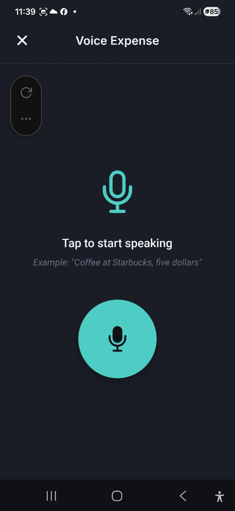
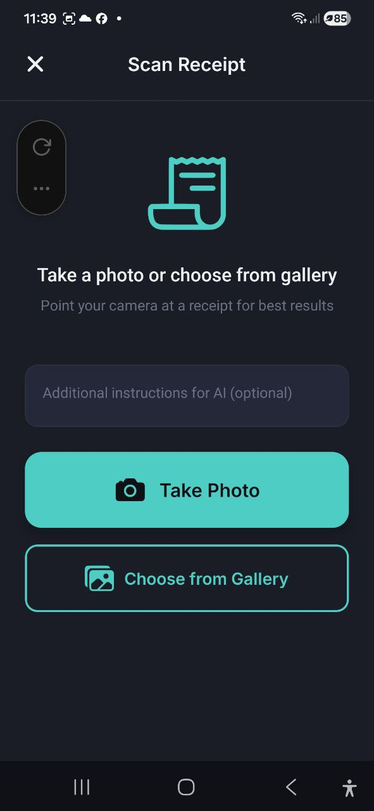

# Wprowadzanie glosowe i skanowanie paragonow

> Pozwol, aby AI wykonal prace za Ciebie. Powiedz swoj wydatek naturalnie lub sfotografuj paragon -- aplikacja automatycznie wyodrebni kwote, opis, sprzedawce i kategorie.

## Wydatek glosowy

### Jak to dziala

1. Dotknij **Glosowo** z szybkich akcji na Pulpicie lub dotknij **+** na ekranie Transakcje i wybierz **Glosowo**
2. Zobaczysz duza ikone mikrofonu z tekstem **"Dotknij aby zaczac mowic"**
3. Dotknij przycisk mikrofonu, aby rozpoczac nagrywanie
4. Mow naturalnie, na przyklad: *"Kawa w Starbucks, piec zlotych"*
5. Dotknij ponownie, aby zatrzymac nagrywanie
6. Aplikacja przetworzy Twoja mowe i wyodrebni szczegoly wydatku

### Ekran potwierdzenia

Po przetworzeniu zobaczysz potwierdzenie z przeanalizowanymi danymi:

- **Kwota** -- wyodrebniona z Twojej mowy (mozna edytowac)
- **Opis** -- na co byl wydatek (mozna edytowac)
- **Sprzedawca** -- gdzie wydales pieniadze (mozna edytowac)
- **Kategoria** -- przypisana automatycznie (mozna edytowac)
- Wskaznik **pewnosci** -- **Wysoka pewnosc** lub **Srednia pewnosc**

Przejrzyj szczegoly, wprowadz ewentualne poprawki, a nastepnie:
- Dotknij **Zapisz wydatek**, aby potwierdzic i zapisac
- Dotknij **Sprobuj ponownie**, aby nagrac ponownie

Po zapisaniu mozesz dotknac **Dodaj kolejny**, aby nagrac nowy wydatek glosowy.

### Wskazowki dla najlepszych wynikow

- Mow wyraznie i uwzglednij zarowno opis przedmiotu, jak i kwote
- Podaj nazwe sprzedawcy, jezeli jest istotna (np. "Obiad w McDonald's, dwanascie euro")
- Okresl walute, jezeli rozni sie od domyslnej
- Utrzymuj prostote -- jeden wydatek na nagranie

## Skanuj paragon

### Jak to dziala

1. Dotknij **Skanuj paragon** z szybkich akcji na Pulpicie lub dotknij **+** na ekranie Transakcje i wybierz **Skanuj paragon**
2. Zobaczysz dwie opcje:
   - **Zrob zdjecie** -- otwiera aparat, aby sfotografowac paragon
   - **Wybierz z galerii** -- wybierz istniejace zdjecie
3. Opcjonalnie wprowadz **Dodatkowe instrukcje dla AI** (np. "Podziel rowno miedzy dwie osoby", "Pomin napiwek")
4. Aplikacja przeanalizuje obraz paragonu i wyodrebni dane

### Ekran potwierdzenia

Po analizie AI zobaczysz:

- **Laczna kwota** -- wyodrebniona z paragonu (mozna edytowac)
- **Opis** -- wygenerowane podsumowanie (mozna edytowac)
- **Sprzedawca** -- nazwa sklepu/restauracji (mozna edytowac)
- **Kategoria** -- przypisana automatycznie (mozna edytowac)
- **Data** -- z paragonu (mozna edytowac)
- **Pozycje** -- poszczegolne pozycje z ilosciami i cenami (jezeli wykryto)
- **Rabat** -- kwota rabatu (jezeli widnieje na paragonie)
- Wskaznik **pewnosci** -- Wysoka lub Srednia
- Przelacznik **Zapisz zdjecie paragonu** -- zachowaj zdjecie dolaczone do wydatku

Przejrzyj i popraw ewentualne szczegoly, a nastepnie:
- Dotknij **Zapisz wydatek**, aby potwierdzic
- Dotknij **Skanuj ponownie**, aby sprobowac z innym zdjeciem

### Wskazowki dla najlepszych wynikow

- Fotografuj w dobrym oswietleniu -- unikaj cieni i odblaskow
- Upewnij sie, ze caly paragon jest widoczny i plasko ulozony
- Trzymaj aparat stabilnie, aby uniknac rozmazania
- Uzyj **Dodatkowe instrukcje dla AI** do specjalnej obslugi (np. "To jest w EUR", "Pomin pierwsza pozycje")

## FAQ

- **P: Jakie jezyki obsluguje wprowadzanie glosowe?**
  **O:** Wprowadzanie glosowe dziala najlepiej w jezyku, na ktory ustawiona jest aplikacja. Obsluguje wszystkie 7 jezykow aplikacji.

- **P: Czy moge skanowac paragony w dowolnym jezyku?**
  **O:** Tak, AI moze przetwarzac paragony w wiekszosci jezykow i wyodrebni kwoty oraz pozycje niezaleznie od jezyka paragonu.

- **P: Dlaczego kwota byla bledna po zeskanowaniu?**
  **O:** Ekstrakcja AI nie zawsze jest idealna. Zawsze przegladaj ekran potwierdzenia i poprawiaj ewentualne bledy przed zapisaniem. Rozmazane lub uszkodzone paragony moga dawac mniej dokladne wyniki.

- **P: Czy wprowadzanie glosowe/skanowanie paragonu zuzywa moje zapytania AI?**
  **O:** Tak, kazde wprowadzenie glosowe lub skan paragonu zuzywa jedno zapytanie AI z Twojego miesiecznego limitu.

---

*Zobacz takze: [Wydatki i przychody](./03-expenses-and-income.md) | [Czat AI](./07-ai-chat.md)*
