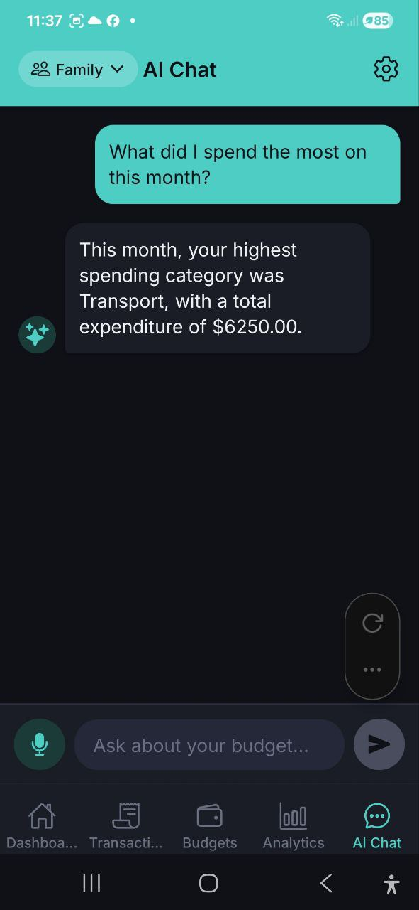

# Czat AI

> Zadawaj pytania o swoje finanse w jezyku naturalnym. Otrzymuj analize wydatkow, porady budzetowe i spersonalizowane wskazowki oszczednosciowe — wszystko z pomoca AI.

## Przeglad

Zakladka **Czat AI** to Twoj osobisty asystent finansowy. Mozesz zadawac pytania w zwyklym jezyku i otrzymywac szczegolowe odpowiedzi oparte na Twoich rzeczywistych danych o wydatkach.

## Jak uzywac

1. Dotknij zakladke **Czat AI** (ostatnia zakladka w dolnej nawigacji)
2. Wpisz pytanie w polu tekstowym na dole (tekst zastepczy: "Zapytaj o swoj budzet...")
3. Dotknij przycisku **wyslij** (ikona strzalki)
4. Przeczytaj odpowiedz AI w dymku czatu

Asystent AI odpowiada analiza oparta na Twoich rzeczywistych danych transakcyjnych dla biezacego konta.

## Przyciski szybkich akcji

Trzy predefiniowane przyciski pojawiaja sie dla czestych pytan:

| Przycisk | Wyslane pytanie |
|---|---|
| **Najwieksze wydatki** | "Na co wydalem najwiecej w tym miesiacu?" |
| **Status budzetu** | "Czy mam budzet pod kontrola?" |
| **Porady oszczednosciowe** | "Daj mi wskazowki, jak oszczedzac pieniadze" |

Dotknij dowolny przycisk, aby natychmiast wyslac to pytanie.

## Wprowadzanie glosowe w czacie

1. Dotknij przycisku **mikrofonu** (po lewej stronie pola tekstowego)
2. Wypowiedz swoje pytanie
3. Transkrybowany tekst jest przetwarzany i wysylany

> **Uwaga:** Status przetwarzania glosu wyswietla sie jako "Przetwarzanie glosu..." podczas transkrypcji.

## Przykladowe pytania

**Pytania analityczne:**
- "Na co wydalem najwiecej w tym miesiacu?"
- "Ile wydalem na jedzenie w zeszlym tygodniu?"
- "Czy mam budzet pod kontrola?"
- "Porownaj moje wydatki w tym miesiacu z poprzednim miesiacem"
- "Jakie sa moje 3 glowne kategorie wydatkow?"
- "Ile wydalem na transport w tym roku?"
- "Daj mi wskazowki, jak oszczedzac pieniadze"
- "Kiedy moj miesieczny budzet sie wyczerpa w tym tempie?"

**Polecenia w jezyku naturalnym:**
- "Dodaj wydatek 500₴ na zakupy"
- "Utworz budzet 10000₴ na rozrywke na marzec"
- "Dodaj przychod 50000₴ z wynagrodzenia"
- "Pokaz moje wydatki z ostatniego tygodnia"
- "Jaki jest status mojego budzetu?"
- "Pokaz podzial wedlug kategorii za ten miesiac"

## Funkcje czatu

- **Historia rozmow** — poprzednie wiadomosci sa zachowywane podczas sesji
- **Wskaznik pisania** — wyswietla "Mysle..." gdy AI przetwarza Twoje pytanie
- **Obsluga bledow** — jezeli cos pojdzie nie tak, zobaczysz komunikat o bledzie z opcja ponowienia
- **Polecenia w jezyku naturalnym** — tworzenie wydatkow, przychodow, budzetow i zapytan o dane uzywajac zwyklego jezyka
- **Potwierdzenie akcji** — podczas tworzenia rekordow finansowych AI pokazuje podglad i prosi o potwierdzenie przed zapisaniem
- **Inteligentne wykrywanie jezyka** — AI automatycznie odpowiada w Twoim jezyku (angielski, rosyjski, ukrainski, bialoruski, niemiecki, hiszpanski, francuski, polski)
- **Rozpoznawanie walut** — obsluga symboli: ₴ (UAH), $ (USD), € (EUR), zł (PLN), £ (GBP), ₽ (RUB)
- **Bot Telegram** — uzywaj tego samego Czatu AI z Telegrama. Wysylaj tekst, wiadomosci glosowe lub zdjecia paragonow bezposrednio do bota
- **Automatyczne wykrywanie konta** — wspomnij nazwe konta w wiadomosci (np. "Pokaz wydatki w Family") a AI automatycznie odpyta to konto

## Limity zapytan AI

Kazda wyslana wiadomosc zuzywa jedno zapytanie AI z Twojego miesiecznego limitu:

| Plan | Zapytania AI miesiecznie |
|---|---|
| **Free** | 5 |
| **Pro** | 200 |
| **Business** | Bez limitu |

Gdy wyczerpiesz zapytania, zostaniesz zachecony do ulepszenia planu.

## Polecenia w jezyku naturalnym

Mozesz teraz **wykonywac rzeczywiste akcje** bezposrednio z czatu:

### Tworzenie rekordow

1. Wpisz polecenie, np.: **"Dodaj wydatek 500₴ na zakupy"**
2. AI pokazuje **karte potwierdzenia** z:
   - Kwota i waluta
   - Kategoria (auto-wykryta lub domyslna)
   - Data (dzis domyslnie)
3. Dotknij **Potwierdz**, aby utworzyc wydatek, lub **Anuluj**, aby odrzucic
4. Po potwierdzeniu wydatek jest zapisany i zobaczysz komunikat o powodzeniu

**Obslugiwane polecenia tworzenia:**
- **Wydatki:** "Dodaj wydatek 500₴ na zakupy", "Wydalem 1200₴ na transport wczoraj"
- **Przychody:** "Dodaj przychod 50000₴ z wynagrodzenia", "Otrzymalem 5000₴ premii"
- **Budzety:** "Utworz budzet 10000₴ na rozrywke na marzec", "Ustaw miesieczny budzet 3000₴ na jedzenie"

### Zapytania o dane

Te polecenia wykonuja sie **natychmiast** i pokazuja wyniki:

- **"Pokaz moje wydatki z ostatniego tygodnia"** → wyswietla liste wydatkow z suma
- **"Jaki jest status mojego budzetu?"** → pokazuje wszystkie budzety z paskami postepu
- **"Pokaz podzial wedlug kategorii za ten miesiac"** → wyswietla wydatki wedlug kategorii z procentami

## FAQ

- **P: Czy AI ma dostep do wszystkich moich danych finansowych?**
  **O:** AI ma dostep do Twoich wydatkow, przychodow, budzetow i kategorii dla aktualnie wybranego konta. Nie ma dostepu do innych kont ani danych osobowych poza transakcjami finansowymi.

- **P: Czy moge uzywac Czatu AI offline?**
  **O:** Nie, Czat AI wymaga polaczenia z internetem do przetwarzania Twoich pytan.

- **P: AI podal bledna odpowiedz. Co powinienem zrobic?**
  **O:** Odpowiedzi AI bazuja na Twoich danych, ale moga okazjonalnie byc niedokladne. Mozesz przeformulowac pytanie, aby uzyskac lepsze wyniki, lub zweryfikowac dane w zakladce Analityka.

- **P: Czy moge cofnac potwierdzona akcje?**
  **O:** Po potwierdzeniu akcji (takiej jak utworzenie wydatku) jest ona zapisywana na Twoim koncie. Mozesz ja usunac recznie z zakladki Wydatki.

- **P: Co sie stanie, jezeli odrzuce akcje?**
  **O:** Jezeli dotkniesz "Anuluj" na karcie potwierdzenia, akcja zostaje odrzucona i nic nie jest zapisywane. AI potwierdzi odrzucenie.

- **P: Czy moge uzywac Czatu AI z Telegrama?**
  **O:** Tak! Polacz Telegram przez Ustawienia i rozmawiaj z botem AI bezposrednio. Wszystkie funkcje dzialaja tak samo — tekst, glos, polecenia i skanowanie paragonow. Zobacz [Bot Telegram](./22-telegram-bot.md) po szczegoly.

- **P: Skad AI wie, o ktore konto pytam?**
  **O:** Jezeli wspomnisz nazwe konta w wiadomosci (np. "wydatki w Family"), AI automatycznie odpyta to konto. W przeciwnym razie uzyje Twojego domyslnego konta.

---

*Zobacz takze: [Historia wydatkow](./08-spending-story.md) | [Analityka](./06-analytics.md)*
