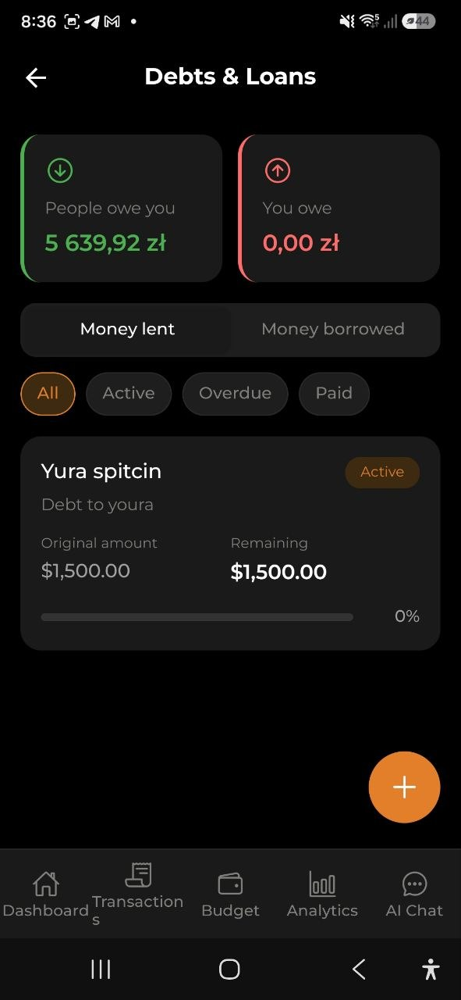

# Długi i pożyczki

> Śledź pieniądze, które pożyczyłeś komuś lub od kogoś. Zobacz, kto jest ci winien i komu ty jesteś winien, zapisuj spłaty i pilnuj terminów — wszystko zintegrowane z wydatkami i przychodami.

## Przegląd

Funkcja «Długi i pożyczki» pozwala śledzić dwa rodzaje zobowiązań finansowych:

- **Pożyczone pieniądze** — pieniądze, które dałeś komuś (zapisywane jako wydatek oznaczony jako dług)
- **Zadłużone pieniądze** — pieniądze, które ktoś dał tobie (zapisywane jako przychód oznaczony jako dług)

Spłaty działają tak samo:
- Gdy ktoś **spłaca tobie** — zapisywane jako przychód powiązany z pierwotnym wydatkiem-długiem
- Gdy **ty spłacasz** — zapisywane jako wydatek powiązany z pierwotnym przychodem-długiem

Status długu jest obliczany automatycznie:
- **Aktywny** — pozostało nieopłacone saldo
- **Spłacony** — dług został spłacony w całości
- **Zaległy** — termin minął, a saldo nadal jest nieopłacone

## Tworzenie długu

Najszybszy sposób na dodanie długu to ekran **Długi i Pożyczki**:

1. Otwórz ekran **Długi i Pożyczki** (z widgetu na Pulpicie lub z Ustawień)
2. Dotknij przycisku **+** w prawym dolnym rogu
3. Wybierz **Pożycz komuś** lub **Pożycz od kogoś**
4. Wpisz kwotę, opis, imię osoby i opcjonalny termin zwrotu
5. Dotknij **Zapisz**

Długi możesz też tworzyć z formularzy wydatków lub przychodów (zobacz niżej).

## Pożyczanie komuś

### Krok po kroku

1. Przejdź do **Transakcje** i dotknij przycisku **+**
2. Wybierz **Ręczne wprowadzanie**
3. Wpisz **kwotę**, którą pożyczasz
4. Wpisz **opis** (np. «Pożyczka dla Jana»)
5. Włącz przełącznik **Pożycz komuś**
6. Wpisz **imię osoby** — komu pożyczasz
7. Opcjonalnie ustaw **termin zwrotu** — kiedy spodziewasz się zwrotu
8. Dotknij **Zapisz wydatek**

Wydatek zostanie oznaczony jako dług i pojawi się na ekranie Długi i Pożyczki.

> **Uwaga:** Kwota wpływa na saldo portfela jak zwykły wydatek (pieniądze wychodzą).

## Pożyczanie od kogoś

### Krok po kroku

1. Przejdź do **Transakcje**, przełącz na zakładkę **Przychody** i dotknij **+**
2. Wpisz **kwotę**, którą pożyczasz
3. Wpisz **opis** (np. «Pożyczka od Marii»)
4. Włącz przełącznik **Pożycz od kogoś**
5. Wpisz **imię osoby** — od kogo pożyczasz
6. Opcjonalnie ustaw **termin zwrotu** — kiedy musisz oddać
7. Dotknij **Zapisz przychód**

Przychód zostanie oznaczony jako dług i pojawi się na ekranie Długi i Pożyczki.

> **Uwaga:** Kwota wpływa na saldo portfela jak zwykły przychód (pieniądze przychodzą).

## Zapisywanie spłaty

### Gdy ktoś spłaca tobie (pieniądze, które pożyczyłeś)

1. Otwórz pierwotny **wydatek** (pożyczkę, której udzieliłeś)
2. Dotknij **Zapisz spłatę**
3. Otworzy się formularz nowego przychodu z wypełnionym imieniem osoby i walutą
4. Wpisz **kwotę spłaty** (może być częściowa)
5. Dotknij **Zapisz przychód**

### Gdy ty spłacasz (pieniądze wzięte w dług)

1. Otwórz pierwotny **przychód** (pożyczkę, którą otrzymałeś)
2. Dotknij **Zapisz spłatę**
3. Otworzy się formularz nowego wydatku z wypełnionym imieniem osoby i walutą
4. Wpisz **kwotę spłaty** (może być częściowa)
5. Dotknij **Zapisz wydatek**

> **Wskazówka:** Możesz zapisać wiele częściowych spłat. Pozostałe saldo aktualizuje się automatycznie.

## Ekran Długi i Pożyczki

Ekran Długi i Pożyczki otworzysz z **Ustawienia > Długi i pożyczki** lub dotykając widgetu długów na Pulpicie.

### Karty podsumowania

Na górze ekranu dwie karty pokazują:
- **Są ci winni** — łączna pozostała kwota, którą są ci winni (zielona)
- **Jesteś winien** — łączna pozostała kwota, którą ty jesteś winien (czerwona)

Kwoty są automatycznie przeliczane na twoją walutę bazową po aktualnych kursach wymiany.

### Zakładki

Przełączaj się między dwoma widokami:
- **Pożyczone** — długi, w których pożyczyłeś pieniądze innym
- **Zadłużone** — długi, w których pożyczyłeś pieniądze od innych

### Filtry

Filtruj długi według statusu:
- **Wszystkie** — pokaż wszystkie długi
- **Aktywne** — tylko długi z nieopłaconym saldem
- **Zaległe** — tylko długi po terminie
- **Spłacone** — tylko długi spłacone w całości

### Karta długu

Każdy dług pokazuje:
- **Imię osoby** — z kim związany jest dług
- **Opis** — za co jest dług
- **Znacznik statusu** — Aktywny (niebieski), Zaległy (czerwony) lub Spłacony (zielony)
- **Kwota początkowa** — początkowa kwota długu w oryginalnej walucie
- **Pozostało** — ile jeszcze trzeba spłacić
- **Pasek postępu** — wizualny wskaźnik postępu spłaty (procent)
- **Termin zwrotu** — kiedy dług jest wymagalny (jeśli ustawiono)

Dotknij karty długu, aby zobaczyć pełne szczegóły wydatku lub przychodu i zapisać spłaty.

## Powiadomienia push

Jeśli dług ma ustawioną datę spłaty, aplikacja wysyła automatyczne powiadomienia push:

- **3 dni przed terminem** — przypomnienie: „Dług za 3 dni: Jan"
- **Dzień po terminie** — powiadomienie o przeterminowaniu: „Dług przeterminowany: Jan"

Powiadomienia są wysyłane do właściciela długu (osoby, która go zapisała), a nie do drugiej strony.

Aby włączyć lub wyłączyć przypomnienia, przejdź do **Ustawienia → Powiadomienia → Przypomnienia o długach**.

## Widget na Pulpicie

Widget Długi i Pożyczki jest zawsze widoczny na Pulpicie (gdy jest włączony w ustawieniach widgetów):

- **Gdy masz długi:** pokazuje sumy «Są ci winni» i «Jesteś winien» oraz przycisk **+** do szybkiego przejścia na ekran Długi i Pożyczki
- **Gdy nie masz długów:** pokazuje pusty stan z przyciskiem **Dodaj dług**, aby zacząć

Dotknij widgetu, aby przejść bezpośrednio do ekranu Długi i Pożyczki.

## Obsługa wielu walut

Długi mogą być w dowolnej obsługiwanej walucie. Sumy na Pulpicie i na ekranie Długów są automatycznie przeliczane na twoją walutę bazową po aktualnych kursach wymiany. Poszczególne karty długów zawsze pokazują kwoty w oryginalnej walucie.

## Najczęściej zadawane pytania

- **P: Czy mogę pożyczyć pieniądze w jednej walucie i otrzymać spłatę w innej?**
  **O:** Spłaty są zapisywane w tej samej walucie co pierwotny dług, aby śledzenie było dokładne.

- **P: Czy pożyczanie pieniędzy wpływa na mój budżet?**
  **O:** Tak, pożyczenie komuś jest zapisywane jako wydatek, a pożyczenie od kogoś jako przychód. Wpływają na saldo portfela i śledzenie budżetu jak każda inna transakcja.

- **P: Czy mogę edytować dług po jego utworzeniu?**
  **O:** Tak, dotknij długu, aby zobaczyć jego szczegóły, a następnie użyj przycisku Edytuj. Możesz zmienić opis, imię osoby i termin zwrotu.

- **P: Co się dzieje, gdy dług zostanie w całości spłacony?**
  **O:** Status automatycznie zmienia się na «Spłacony», a pasek postępu pokazuje 100%. Dług zostaje w historii do wglądu.

- **P: Jak usunąć dług?**
  **O:** Otwórz szczegóły długu i dotknij Usuń. Pamiętaj, że usuwa to również powiązany wpis wydatku lub przychodu.

---

*Zobacz także: [Wydatki i przychody](./03-expenses-and-income.md) | [Portfel i wymiana walut](./10-wallet-and-exchange.md)*
