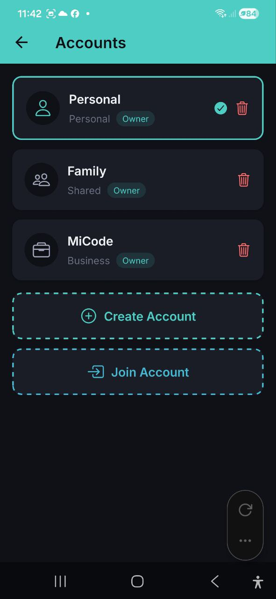
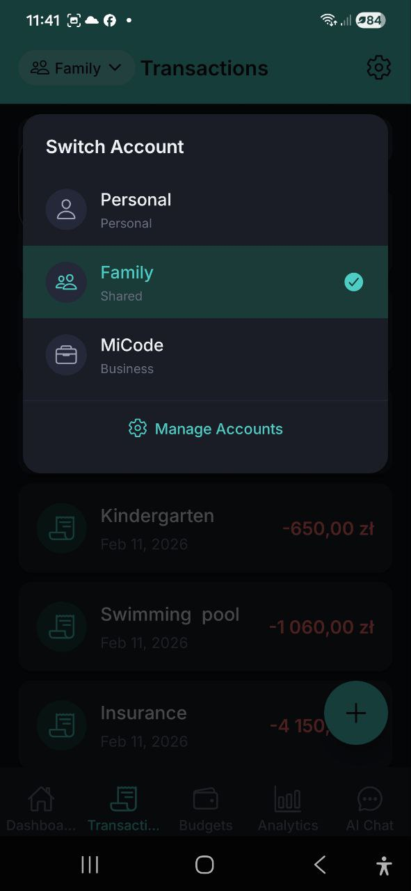
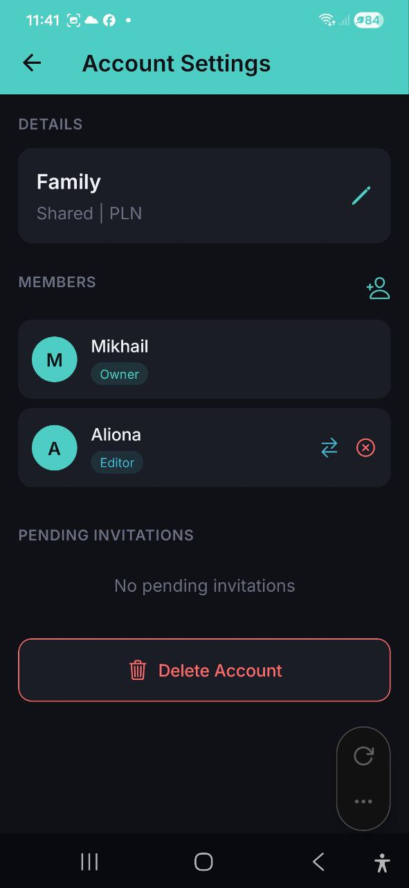

# Счета

> Организуйте свои финансы с помощью отдельных счетов. Используйте Личный для индивидуального учёта, Общий для семейных бюджетов и Бизнес для корпоративных расходов. Приглашайте участников с ролевым разграничением доступа.

## Обзор

Приложение поддерживает несколько счетов для разделения различных финансовых контекстов. Каждый счёт имеет собственные расходы, доходы, бюджеты и кошелёк.

## Типы счетов

| Тип | Значок | Назначение |
|---|---|---|
| **Личный** | Значок человека | Индивидуальный учёт расходов |
| **Общий** | Значок людей | Семейные или групповые бюджеты (например, «Семья») |
| **Бизнес** | Значок портфеля | Корпоративные или командные расходы (например, «MiCode») |
| **Инвестиции** | Значок тренда вверх | Отслеживание инвестиционных портфелей и активов |

Каждый счёт показывает свой тип и вашу роль (Владелец, Редактор или Наблюдатель).

## Переключение счетов

1. Нажмите на **название счёта** в верхнем левом углу любого экрана (например, «Семья»)
2. Откроется выпадающий список **Переключить счёт**, показывающий все ваши счета
3. Нажмите на счёт, на который хотите переключиться
4. Активный счёт отмечен зелёной галочкой
5. Все экраны обновляются, отображая данные выбранного счёта

Нажмите **Управление счетами** в нижней части выпадающего списка, чтобы перейти к полному списку счетов.

## Изменение валюты отображения

Меняйте валюту, в которой показываются все ваши суммы, — с любого экрана, не заходя в Настройки.

На главном экране самый быстрый способ — отдельная **кнопка валюты** рядом с названием счёта: нажмите на неё и выберите нужную валюту. На остальных экранах:

1. Нажмите на **название счёта** в верхнем левом углу любого экрана. Рядом с названием показан символ текущей валюты (например, `Личный · $`).
2. В открывшемся меню найдите раздел **Валюта отображения** под списком счетов.
3. Нажмите нужную валюту (USD, EUR, PLN, GBP, UAH, RUB, BYN).
4. Все суммы в приложении мгновенно пересчитываются в выбранную валюту по актуальным курсам.

> Это ваша личная валюта отображения, она сохраняется на будущее. Меняется только то, как суммы *показываются*, — ваши транзакции сохраняют свои исходные валюты. Каждый участник (включая Наблюдателей) может выбрать свою валюту отображения.

## Создание счёта

1. Перейдите к списку счетов (через **Управление счетами** или из Настроек)
2. Нажмите **Создать счёт**
3. Введите **Название счёта** (например, «Мой бюджет»)
4. Выберите **Тип счёта**: Личный, Общий, Бизнес или Инвестиции
5. Выберите **Валюту** для этого счёта
6. Нажмите **Создать**

> **Примечание:** Бесплатный план позволяет 3 счёта, Pro — до 5, Business — неограниченное количество.

## Присоединение к счёту

Если вас пригласили в чужой счёт:

1. Нажмите **Присоединиться к счёту** в списке счетов
2. Введите **код приглашения**, который вы получили
3. Нажмите **Присоединиться**
4. Вы увидите сообщение об успехе: «Вы успешно присоединились!»
5. Счёт теперь отображается в вашем списке счетов

## Настройки счёта

Нажмите на любой счёт, чтобы открыть его настройки:

### Детали
- **Название** счёта (редактируется Владельцем)
- **Тип** счёта и **валюта** (только для просмотра)

### Участники
- Список всех участников счёта с их ролями
- Для каждого участника: аватар, имя и значок роли (Владелец, Редактор, Наблюдатель)

### Приглашение участников

1. Откройте Настройки счёта
2. Нажмите **значок приглашения** (значок «человек+» вверху справа в секции Участники)
3. Выберите способ приглашения:
   - **По email** — введите email-адрес приглашаемого, выберите роль (Редактор или Наблюдатель), нажмите **Отправить приглашение**
   - **По ссылке** — генерируется код, которым можно поделиться. Нажмите, чтобы скопировать или отправить через мессенджеры

### Управление участниками (только Владелец)

- **Изменить роль** — нажмите значок смены роли рядом с участником, чтобы назначить новую роль
- **Удалить участника** — нажмите значок удаления, чтобы удалить участника (с подтверждением)

### Ожидающие приглашения

- Просмотр приглашений, которые ещё не были приняты
- **Отменить приглашение** — отозвать ожидающее приглашение

## Роли и права доступа

| Право | Владелец | Редактор | Наблюдатель |
|---|---|---|---|
| Просмотр расходов и доходов | Да | Да | Да |
| Добавление/редактирование расходов | Да | Да | Нет |
| Добавление/редактирование доходов | Да | Да | Нет |
| Создание/редактирование бюджетов | Да | Да | Нет |
| Управление участниками | Да | Нет | Нет |
| Изменение настроек счёта | Да | Нет | Нет |
| Удаление счёта | Да | Нет | Нет |

### Описания ролей
- **Владелец** — полный контроль над счётом, может управлять участниками и настройками
- **Редактор** — может добавлять и редактировать расходы, доходы и бюджеты
- **Наблюдатель** — может только просматривать данные (доступ только для чтения)

## Удаление счёта

1. Откройте Настройки счёта
2. Прокрутите до конца и нажмите **Удалить счёт**
3. Подтвердите удаление

> **Внимание:** Удаление счёта безвозвратно удаляет все его данные (расходы, доходы, бюджеты). Это действие нельзя отменить.

## Выход из счёта

Если вы являетесь участником (не Владельцем) общего счёта:
1. Откройте Настройки счёта
2. Нажмите **Покинуть счёт**
3. Подтвердите — вы будете удалены из счёта

## Переключение счетов в Telegram

При использовании Telegram-бота вы можете переключать счета двумя способами:

1. **Вручную** — отправьте `/account` и нажмите на нужный счёт
2. **Автоматически** — упомяните название счёта в сообщении (например, «Покажи расходы в Family»), и ИИ обратится к этому счёту для текущего запроса

Автоматическое определение не меняет счёт по умолчанию — оно действует только для текущего сообщения. Используйте `/account` для постоянного переключения.

## Часто задаваемые вопросы

- **В: Сколько счетов можно иметь?**
  **О:** Free: 3 счёта, Pro: до 5, Business: неограниченно.

- **В: Можно ли передать владение счётом?**
  **О:** В настоящее время создатель счёта всегда является Владельцем. Обратитесь в службу поддержки для передачи владения.

- **В: Можно ли увидеть, кто добавил расход в общем счёте?**
  **О:** Расходы в общих счетах показывают, какой участник их создал.

- **В: Можно ли использовать разные счета в Telegram-боте?**
  **О:** Да. Отправьте `/account` для переключения счёта по умолчанию или просто упомяните название счёта в сообщении для одноразового запроса. Подробнее: [Telegram Бот](./22-telegram-bot.md).

---

*См. также: [Настройки](./11-settings.md) | [Тарифные планы](./12-subscription.md)*
