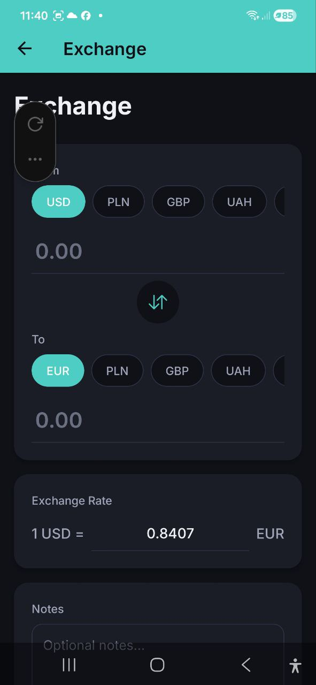

# Кошелёк и обмен валют

> Отслеживайте балансы в нескольких валютах и обменивайте между ними по актуальным курсам. Кошелёк автоматически обновляется при добавлении расходов и доходов.

## Обзор

Функция Кошелёк позволяет отслеживать ваши реальные балансы в каждой поддерживаемой валюте. При добавлении расходов и доходов кошелёк автоматически обновляется, отражая вашу текущую финансовую позицию.

## Балансы кошелька

Доступ к Кошельку:
- **Главная** — нажмите **Показать все** рядом с секцией Баланс кошелька
- **Настройки** — перейдите в Кошелёк > **Балансы**

Для каждой валюты отображается:

| Поле | Описание |
|---|---|
| **Текущий баланс** | Ваш баланс в реальном времени в этой валюте |
| **Начальный баланс** | Стартовый баланс, который вы установили |
| **Общий доход** | Сумма всех доходов в этой валюте |
| **Всего потрачено** | Сумма всех расходов в этой валюте |
| **Получено обменом** | Сумма, полученная при обмене валют |
| **Обменяно** | Сумма, потраченная на обмен валют |
| **Переведено входящий** | Сумма, полученная переводами с других счетов |
| **Переведено исходящий** | Сумма, отправленная переводами на другие счета |

Формула: **Текущий баланс = Начальный баланс + Общий доход - Всего потрачено + Получено обменом - Обменяно + Переведено входящий - Переведено исходящий**

## Общий баланс

Если у вас есть балансы в нескольких валютах, приложение показывает карточку **Общий баланс** в верхней части экрана Кошелька. Эта карточка конвертирует все ваши валютные балансы в единую валюту (установленную в Настройках) по актуальным курсам обмена, чтобы вы могли видеть общую стоимость всех ваших средств в одном месте.

## Установка начального баланса

Установите стартовый баланс для каждой валюты:

### Пошагово: Установка баланса

1. Перейдите в **Настройки** > **Кошелёк** > **Установить баланс**
2. Выберите **Валюту** (USD, EUR, PLN, GBP, UAH или RUB)
3. Введите **Сумму** — ваш текущий реальный баланс в этой валюте
4. Нажмите **Сохранить**

Вы увидите подтверждение: «Баланс успешно установлен».

> **Совет:** Установите начальные балансы при первом использовании приложения, чтобы кошелёк точно отражал ваши финансы с первого дня.

## Обмен валют

Обменивайте средства между вашими валютными кошельками:

### Пошагово: Обмен валют

1. Нажмите **Обмен** в быстрых действиях на Главной или перейдите в **Настройки** > **Кошелёк**
2. Выберите валюту **Из** (например, USD) — нажмите на чип валюты
3. Выберите валюту **В** (например, EUR) — нажмите на чип валюты
4. Введите сумму в поле «Из» или «В» — второе поле рассчитается автоматически
5. **Курс обмена** загружается автоматически (например, «1 USD = 0.8407 EUR»)
6. Можно нажать кнопку **обмена** (стрелки по центру), чтобы поменять валюты местами
7. При необходимости отредактируйте курс обмена вручную, если ваш реальный курс отличается
8. Добавьте необязательные **Заметки** (например, «Обмен в аэропорту» или «Банковский перевод»)
9. Нажмите **Обменять** для завершения

### Возможности

- **Актуальные курсы** — автоматически загружаются и отображаются
- **Кнопка обмена** — быстро меняет валюты Из и В местами
- **Ручная корректировка курса** — измените курс, если ваш фактический курс отличается
- **Поле заметок** — добавьте контекст к обмену
- **Последние обмены** — просмотр истории обменов

### Последние обмены

Под формой обмена расположен список ваших последних обменов валют с:
- Обменянными валютами (Из -> В)
- Суммами
- Использованным курсом обмена
- Датой
- Заметками (если добавлены)

## Переводы между счетами

Переводите средства между вашими счетами (например, с бизнес-счёта на личный). Переводы обновляют балансы кошельков обоих счетов.

### Пошагово: Перевод между счетами

1. Перейдите в **Настройки** > **Кошелёк** > **Перевод**
2. Выберите **Счёт-отправитель** — счёт, с которого вы отправляете средства
3. Выберите **Счёт-получатель** — счёт, на который вы переводите средства
4. Выберите **Валюту** перевода
5. Введите **Сумму** перевода
6. Если валюты счетов различаются, укажите **Курс обмена** — он загружается автоматически, но можно скорректировать вручную
7. При необходимости добавьте **Заметки** (например, «Пополнение личного счёта» или «Возврат средств»)
8. Нажмите **Перевести** для завершения

### Последние переводы

Под формой перевода расположен список ваших последних переводов между счетами с:
- Счётом-отправителем и счётом-получателем
- Суммой и валютой
- Курсом обмена (если валюты различаются)
- Датой
- Заметками (если добавлены)

## Поддерживаемые валюты

| Код | Валюта |
|---|---|
| USD | Доллар США |
| EUR | Евро |
| PLN | Польский злотый |
| GBP | Британский фунт |
| UAH | Украинская гривна |
| RUB | Российский рубль |

## Часто задаваемые вопросы

- **В: Откуда берутся курсы обмена?**
  **О:** Курсы загружаются из онлайн-сервиса и регулярно обновляются. Они представляют приблизительные рыночные курсы.

- **В: Можно ли обменять валюту, если баланса недостаточно?**
  **О:** Приложение предупредит о недостаточном балансе, но вы всё равно можете записать обмен, чтобы ваши записи были точными.

- **В: Считается ли обмен валюты расходом?**
  **О:** Нет. Обмены валют отделены от расходов — они перемещают средства между валютными кошельками, не влияя на итоги расходов.

- **В: Чем перевод между счетами отличается от обмена валют?**
  **О:** Обмен валют конвертирует средства между валютами внутри одного счёта. Перевод между счетами перемещает средства между разными счетами (например, с бизнес-счёта на личный).

- **В: Считается ли перевод между счетами расходом или доходом?**
  **О:** Нет. Переводы между счетами отдельны от расходов и доходов — они просто перемещают средства между вашими счетами.

---

*См. также: [Главная](./02-dashboard.md) | [Настройки](./11-settings.md)*
