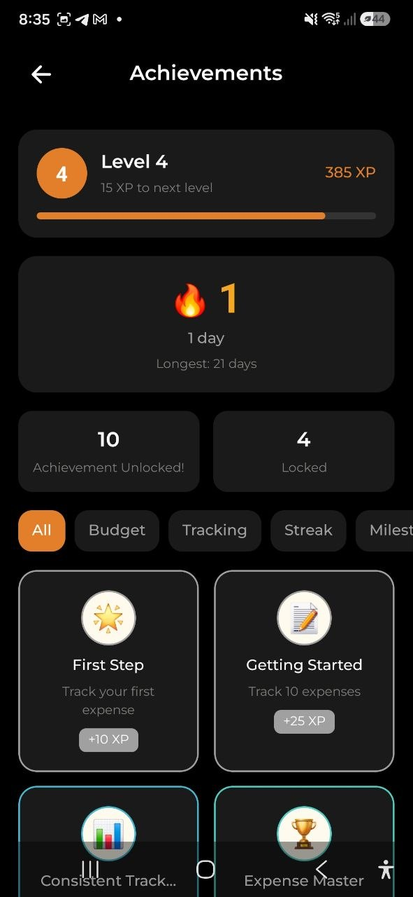

# Досягнення та гейміфікація

> Залишайтеся мотивованими завдяки досягненням, щоденним серіям, досвіду та рівням. Відстежуйте свої фінансові звички та отримуйте значки, будуючи послідовність.

## Огляд

Система гейміфікації нагороджує вас за послідовне відстеження фінансів. Кожна витрата, дохід та бюджет, якими ви керуєте, сприяють вашому прогресу. Заробляйте досягнення, підтримуйте щоденні серії та підвищуйте рівень, формуючи кращі фінансові звички.

## Віджет на Головній

На головному екрані ви побачите компактну картку гейміфікації, що відображає:

- **Рівень** — ваш поточний рівень зі смужкою прогресу досвіду
- **Серія** — ваша поточна щоденна серія відстеження (емодзі вогню, коли активна, сніжинки — коли неактивна)

Натисніть на віджет, щоб відкрити повний екран **Досягнень**.

## Досягнення

Досягнення — це контрольні точки, що нагороджують вас за певні фінансові дії. Кожне досягнення має:

- **Іконка** — візуальне емодзі, що представляє досягнення
- **Назва та опис** — що потрібно зробити для отримання
- **Рідкісність** — Звичайне, Рідкісне, Епічне або Легендарне
- **Нагорода досвідом** — очки досвіду, що нараховуються після виконання
- **Прогрес** — відсоток виконання (для незавершених досягнень)

### Категорії досягнень

| Категорія | Приклади |
|---|---|
| **Віха** | Відстежте першу витрату, досягніть 10/50/100/500 витрат |
| **Бюджет** | Створіть перший бюджет, залишайтесь в межах бюджету 1 або 3 місяці |
| **Серія** | Підтримуйте серію відстеження 3/7/30/100 днів |
| **Заощадження** | Запишіть перший дохід, завершіть місяць з доходом, що перевищує витрати |

### Перегляд досягнень

1. Натисніть на віджет гейміфікації на Головній або перейдіть на екран Досягнень
2. Використовуйте **фільтри категорій** (Усі, Бюджет, Відстеження, Серія, Віха, Заощадження) для перегляду
3. **Натисніть на будь-який значок**, щоб побачити повний опис, рідкісність, значення досвіду та ваш прогрес

Завершені досягнення відображаються у повному кольорі з рамкою рідкісності. Заблоковані досягнення відображаються сірими зі смужкою прогресу.

## Щоденна серія

Ваша серія рахує послідовні дні, протягом яких ви відстежуєте хоча б одну витрату або дохід. Серія скидається, якщо ви пропустите день.

- **Активна серія** — відображається з емодзі вогню та кількістю днів
- **Перервана серія** — відображається з емодзі сніжинки та пропозицією почати знову
- **Найдовша серія** — ваш особистий рекорд відстежується та відображається на екрані Досягнень

> **Порада:** Додавайте щонайменше одну транзакцію щодня, щоб підтримувати серію!

## Досвід та рівні

- Кожне завершене досягнення нагороджує досвідом (очками досвіду)
- **100 досвіду** потрібно для підвищення на один рівень
- Нагороди досвідом варіюються від **10 досвіду** (Звичайні досягнення) до **500 досвіду** (Легендарні досягнення)
- Ваш рівень та прогрес досвіду відображаються як на віджеті Головної, так і на екрані Досягнень

## Рідкісність досягнень

| Рідкісність | Колір | Діапазон досвіду |
|---|---|---|
| **Звичайне** | Сірий | 10–25 досвіду |
| **Рідкісне** | Синій | 25–50 досвіду |
| **Епічне** | Бірюзовий | 50–100 досвіду |
| **Легендарне** | Золотий | 100–500 досвіду |

Легендарні досягнення мають особливий золотий ефект мерехтіння при розблокуванні.

## Сповіщення про розблоковане досягнення

Коли ви отримуєте нове досягнення (наприклад, після додавання витрати), з'являється святкове модальне вікно, що показує:

- Іконку та назву досягнення
- Отриманий досвід
- Кнопку закриття

Це сповіщення з'являється автоматично і не перериває ваш робочий процес.

## Часті запитання

- **П: Як відстежуються досягнення?**
  **В:** Досягнення оцінюються автоматично кожного разу, коли ви додаєте витрату, дохід або бюджет. Жодних ручних дій не потрібно.

- **П: Чи скидається серія, якщо я офлайн?**
  **В:** Ваша серія відстежується на сервері з урахуванням вашого часового поясу. Якщо ви додасте транзакцію офлайн, вона буде оцінена після синхронізації.

- **П: Чи доступні досягнення на безкоштовному плані?**
  **В:** Так! Усі досягнення, серії та функції гейміфікації безкоштовні для всіх користувачів.

- **П: Чи можу я побачити прогрес до заблокованих досягнень?**
  **В:** Так, натисніть на будь-який заблокований значок досягнення, щоб побачити поточний відсоток прогресу та що потрібно для розблокування.

---

*Див. також: [Головна](./02-dashboard.md) | [Витрати та доходи](./03-expenses-and-income.md)*
