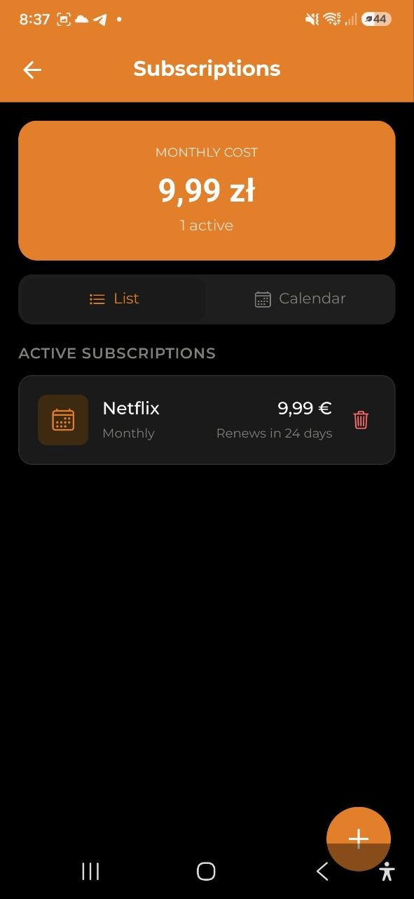

# Менеджер підписок

> Відстежуйте всі регулярні платежі в одному місці — стрімінгові сервіси, SaaS-інструменти, спортзал та інше.

## Що таке менеджер підписок?

Менеджер підписок — це окремий трекер для регулярних платежів. На відміну від транзакцій, підписки не визначаються автоматично — ви додаєте їх вручну або через кнопку **«Відстежувати»** у знахідках Fat Finder.

Кожна підписка містить:
- Назву (Netflix, Spotify, спортзал…)
- Суму та валюту
- Період оплати (щомісяця, щороку, щокварталу, щотижня)
- Дату наступного списання
- Категорію (необов'язково)
- Нотатки (необов'язково)

## Додавання підписки

**Вручну:**
1. Перейдіть до **Налаштування → Підписки** (або натисніть посилання «Підписки» на головному екрані)
2. Натисніть кнопку **+**
3. Введіть назву, суму, період оплати та дату наступного списання
4. Натисніть **Зберегти**

**З Fat Finder:**
Якщо Fat Finder виявив регулярний платіж, натисніть **«Відстежувати цю підписку»** на картці знахідки. Назва та сума заповняться автоматично — просто підтвердіть дату списання.

## Загальна сума на місяць

Вгорі менеджера підписок відображається **загальна щомісячна сума** — всі активні підписки приводяться до місячного значення:
- Щомісячні — сума як є
- Щорічні — сума ÷ 12
- Щоквартальні — сума ÷ 3
- Щотижневі — сума × (52 ÷ 12)

## Зворотний відлік до списання

Кожна підписка показує, скільки днів залишилось до наступного списання:
- **Червоний** — прострочено або списання сьогодні
- **Жовтий** — списання протягом 3 днів
- **Звичайний** — більше 3 днів

## Сповіщення про списання

Ви отримаєте push-сповіщення **за 3 дні** до кожного списання. Щоб налаштувати це:

1. Перейдіть до **Налаштування → Сповіщення**
2. Увімкніть або вимкніть **Сповіщення про підписки**

## Редагування та деактивація

Натисніть на будь-яку підписку, щоб відкрити екран редагування. Ви можете:
- Змінити суму, період оплати або дату списання
- Додати або змінити категорію
- Перемкнути **Активна / Неактивна** — неактивні підписки залишаються у списку, але не враховуються в загальній сумі
- Видалити підписку

## Роль «Глядач»

Якщо ваша роль в обліковому записі — **Глядач**, ви можете переглядати список підписок, але не можете додавати, редагувати або видаляти їх.
